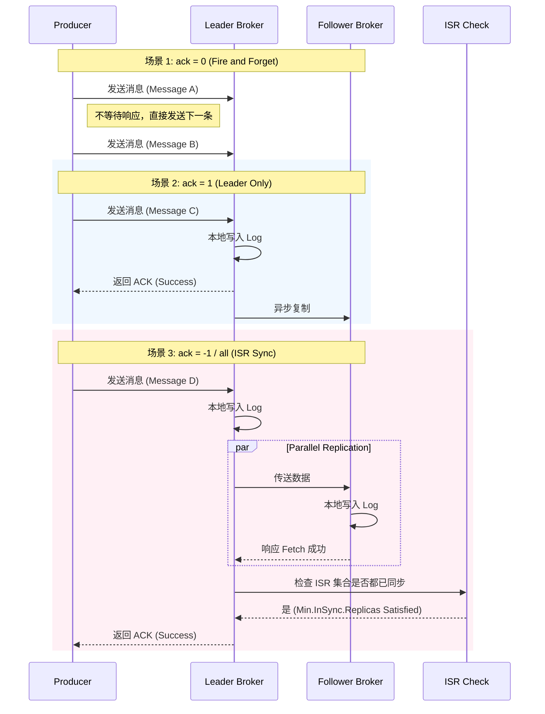
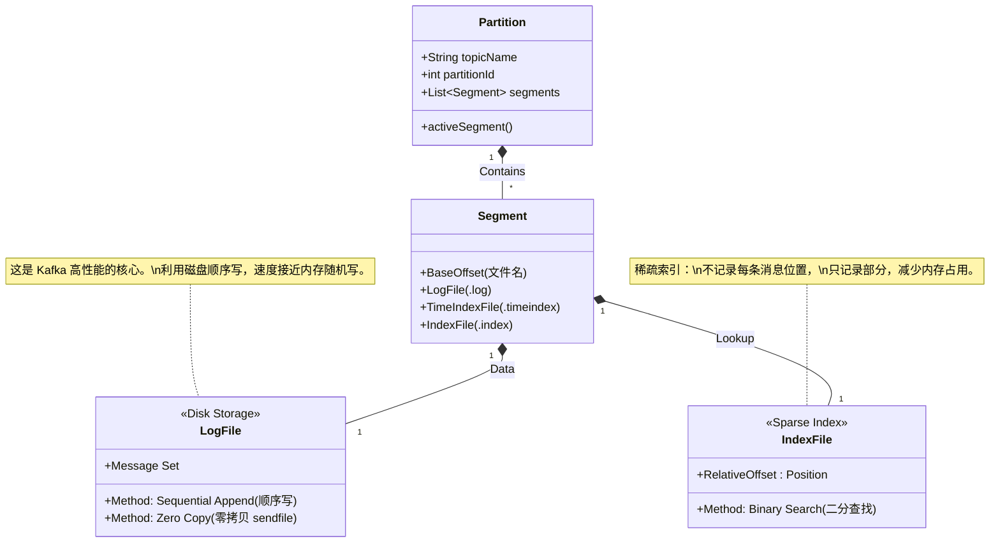

这是一个非常棒的学习切入点。Kafka 的架构既包含宏观的分布式集群管理，又包含微观的底层存储优化。

为了让你全面理解并掌握用 Mermaid 表达这些概念，我将 **分层次** 构建图表。我们将从“宏观架构”深入到“微观存储”和“交互流程”。

你可以直接复制这些 Mermaid 代码到你的 Markdown 编辑器（如 Notion, Obsidian, GitHub）中渲染。

-----

### 第一层：宏观物理架构 (Cluster, ZK, Broker)

这张图展示 **组件之间的静态关系**。重点在于 ZooKeeper 如何管理集群，以及 Topic 和 Partition 究竟在哪里。

* **ZooKeeper**: 保存元数据（Metadata），管理 Broker 上下线。
* **Broker**: 物理服务器节点。
* **Partition**: 物理上的最小存储单元，分布在不同的 Broker 上。

<!-- end list -->

```mermaid
flowchart TD
    %% 定义样式
    classDef zk fill:#f9f,stroke:#333,stroke-width:2px;
    classDef broker fill:#dfd,stroke:#333,stroke-width:2px;
    classDef topic fill:#bbf,stroke:#333,stroke-width:1px,stroke-dasharray: 5 5;
    
    %% Zookeeper 集群
    subgraph ZK_Cluster [ZooKeeper Cluster]
        ZK[ZooKeeper Leader/Followers]:::zk
        MetaData[("元数据\n(Controller, Configs,\n Topic, ACLs)")]:::zk
        ZK --- MetaData
    end

    %% Kafka 集群
    subgraph Kafka_Cluster [Kafka Cluster]
        direction TB
        
        %% Broker 1
        subgraph Broker1 [Broker-1 (ID:1)]
            P1_0(Topic A - Partition 0\nLeader)
            P2_1(Topic B - Partition 1\nFollower)
        end
        
        %% Broker 2
        subgraph Broker2 [Broker-2 (ID:2)]
            P1_1(Topic A - Partition 1\nLeader)
            P2_0(Topic B - Partition 0\nFollower)
        end
        
        %% Broker 3
        subgraph Broker3 [Broker-3 (ID:3)]
            P1_0_R(Topic A - Partition 0\nFollower)
            P2_0_R(Topic B - Partition 0\nLeader)
        end
    end

    %% 外部交互
    Producer([Producer]):::topic --> |Push Data| Kafka_Cluster
    Kafka_Cluster --> |Pull Data| Consumer([Consumer]):::topic

    %% 管理链路
    ZK -.-> |Watch / Manage| Broker1:::broker
    ZK -.-> |Watch / Manage| Broker2:::broker
    ZK -.-> |Watch / Manage| Broker3:::broker

    %% 注释
    note[Controller 选举 & \n元数据同步]
    ZK_Cluster -.-> note
```

-----

### 第二层：Leader/Follower 复制与 ISR 数据流转

这张图专注于 **高可用性（High Availability）**。展示数据是如何从 Leader 流向 Follower 的。

[Image of Kafka partition replication]

* **Leader**: 负责所有的读写请求。
* **Follower**: 被动从 Leader 拉取（Fetch）数据。
* **ISR (In-Sync Replicas)**: 只有跟上了 Leader 进度的副本才在 ISR 集合中。

<!-- end list -->

```mermaid
flowchart LR
    subgraph Partition_Replication [Topic A - Partition 0 复制机制]
        direction LR
        
        %% 生产者写入
        Producer --> |1. Send Message| Leader
        
        %% Leader 节点
        subgraph Node1 [Broker 1]
            Leader[("Leader 副本\n(RW)")] 
        end
        
        %% Follower 节点
        subgraph Node2 [Broker 2]
            Follower1[("Follower 副本\n(Read Only)")]
        end
        
        subgraph Node3 [Broker 3]
            Follower2[("Follower 副本\n(Read Only)")]
        end

        %% 复制流
        Leader --> |2. Replicate Log| Follower1
        Leader --> |2. Replicate Log| Follower2
        
        %% ISR 概念
        subgraph ISR_List [ISR (In-Sync Replicas)]
            direction TB
            Note[ISR 列表: 1, 2, 3]
        end
        
        Node1 -.-> ISR_List
        Node2 -.-> ISR_List
        Node3 -.-> ISR_List
    end
```

-----

### 第三层：生产者的 ACK 机制 (Sequence Diagram)

这张时序图解释 **数据一致性与性能的权衡**。`acks` 是 Kafka 中最重要的配置之一。

* **ack=0**: 发完就走，最快但最不安全。
* **ack=1**: Leader 收到即成功，折中。
* **ack=-1/all**: ISR 中所有副本收到才算成功，最慢但最安全。

<!-- end list -->



-----

### 第四层：微观存储结构 (Log, Segment, Index)

这张图展示 **磁盘落盘** 的细节。这是 Kafka 高吞吐量的核心秘密：**顺序写（Sequential Write）**。

* **Segment**: Partition 被切分为多个 Segment 文件（防止文件过大）。
* **Sequential Write**: 永远只在文件末尾追加（Append Only），避免磁盘磁头随机寻道。
* **Sparse Index (稀疏索引)**: `.index` 文件不会为每条消息建立索引，而是每隔几KB建立一个，用于快速定位。

<!-- end list -->



-----

### 第五层：消费者组与 Offset 提交

最后，展示消费者如何通过 **Consumer Group** 协同工作并记录消费进度（Offset）。

```mermaid
flowchart TB
    subgraph Kafka_Server
        T_P0[Topic A - P0]
        T_P1[Topic A - P1]
        T_P2[Topic A - P2]
        
        Offset_Topic[("__consumer_offsets\n(内部 Topic)")]
    end

    subgraph Consumer_Group [Consumer Group: 'OrderService']
        C1[Consumer A]
        C2[Consumer B]
    end

    %% 消费关系
    T_P0 ==> |Pull / Fetch| C1
    T_P1 ==> |Pull / Fetch| C1
    T_P2 ==> |Pull / Fetch| C2

    %% 提交 Offset
    C1 -.-> |Commit Offset (P0: 100)| Offset_Topic
    C2 -.-> |Commit Offset (P2: 50)| Offset_Topic

    note[Rebalance: \n当消费者挂掉，\nPartition 会重新分配给其他消费者]
    Consumer_Group -.-> note
```

-----

### 总结关键概念 (Key Takeaways)

1.  **数据流向**: Producer -\> Leader -\> Follower。Consumer 只从 Leader 读（Kafka 2.4+ 允许从 Follower 读，但在架构图通常以 Leader 为主）。
2.  **存储**: Partition -\> Segment -\> .log & .index。核心是 **Append Only（追加写）**。
3.  **可靠性**: 依靠 `ack=-1` 和 `ISR` 机制保证数据不丢失。
4.  **消费**: 依靠 Consumer Group 实现负载均衡，通过 `__consumer_offsets` 记录读到了哪里。

**下一步：**
你想针对其中某一个具体环节（比如 **Rebalance 重平衡的过程** 或者 **PageCache 与零拷贝的底层原理**）再画一张更深度的图吗？
