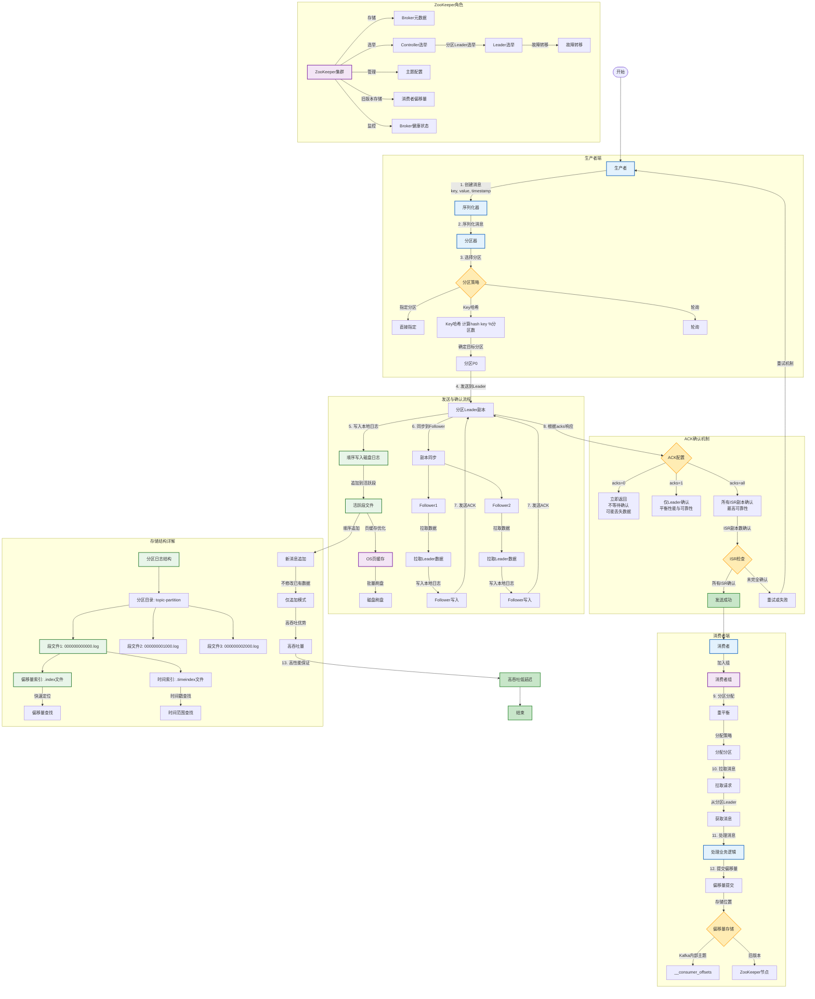
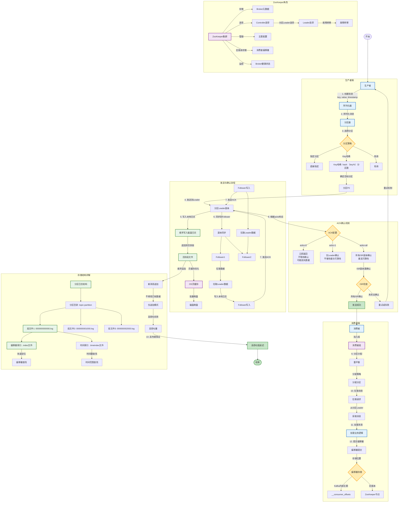

# 深入理解kafka

# Kafka 核心架构与数据流转图

我将用 Mermaid 绘制 Kafka 的完整架构图，展示各个组件之间的关系和数据流转过程。

## Kafka 核心概念解释

### 1. **核心组件**
- **Producer（生产者）**：发布消息到Kafka主题
- **Consumer（消费者）**：从主题订阅并处理消息
- **Broker（代理）**：Kafka服务器，存储数据，处理请求
- **Topic（主题）**：消息类别/通道，分为多个分区
- **Partition（分区）**：主题的细分，每个分区有序
- **ZooKeeper（ZK）**：管理集群元数据、领导者选举、配置管理

### 2. **数据流转流程**
1. **生产者发送**：生产者根据键的哈希值选择分区
2. **ACK确认**：生产者根据acks配置等待确认
    - `acks=0`：不等待确认，可能丢失数据
    - `acks=1`：等待Leader确认
    - `acks=all`：等待所有ISR副本确认（最安全）
3. **Leader处理**：Leader将消息写入本地日志
4. **副本同步**：Followers从Leader拉取数据并复制
5. **消费者消费**：消费者从分区拉取消息处理
6. **偏移量提交**：消费者提交已处理消息的偏移量

### 3. **副本机制**
- **Leader**：每个分区有一个Leader，处理所有读写请求
- **Follower**：副本，从Leader同步数据
- **ISR（In-Sync Replicas）**：与Leader保持同步的副本集合
- **复制因子**：副本总数（图中示例为3）

### 4. **存储与性能优化**
- **顺序写入**：仅追加到日志末尾，充分利用磁盘顺序I/O性能
- **分段日志**：将分区拆分为多个段文件，便于维护和清理
- **页缓存**：利用操作系统页缓存，减少磁盘I/O
- **零拷贝**：使用sendfile系统调用，减少内核态到用户态的数据拷贝

### 5. **消费者组**
- 同一消费者组内的消费者共享订阅主题
- 每个分区只能被组内一个消费者消费
- 支持水平扩展和故障转移

这个架构图展示了Kafka高吞吐、可扩展、持久化消息系统的核心设计原理，包括其分布式、分区、复制和顺序I/O等关键特性。

# Kafka 数据流转与核心机制流程图

我来画一个更清晰的流程图，展示 Kafka 的数据流转过程和核心机制：

## Kafka 数据流转流程详解

### **1. 生产者发送流程**
1. **创建消息**：生产者创建包含key、value、时间戳的消息
2. **序列化**：消息被序列化为字节数组
3. **分区选择**：
    - 直接指定分区
    - 根据key哈希值选择分区（确保相同key到同一分区）
    - 轮询分配分区（负载均衡）
4. **发送到Leader**：消息发送到对应分区的Leader副本

### **2. 存储与复制流程**
5. **Leader写入**：Leader将消息顺序追加到本地日志文件
6. **页缓存优化**：利用操作系统页缓存，延迟刷盘，提高性能
7. **副本同步**：
    - Followers从Leader拉取数据
    - Followers将数据写入本地日志
    - Followers向Leader发送确认

### **3. ACK确认机制**
8. **ACK响应**：
    - **acks=0**：不等待确认，性能最高，可能丢失数据
    - **acks=1**：等待Leader确认，平衡性能与可靠性
    - **acks=all**：等待所有ISR副本确认，最可靠但延迟最高

### **4. 消费者消费流程**
9. **消费者组协调**：消费者加入组，触发重平衡
10. **分区分配**：组协调器为消费者分配分区
11. **拉取消息**：消费者从分配的分区拉取消息
12. **偏移量提交**：
    - 自动提交（定期提交）
    - 手动提交（处理成功后提交）
    - 存储位置：Kafka内部主题或ZooKeeper

### **5. 存储结构特点**
- **分段日志**：分区日志分为多个段文件，便于管理和清理
- **索引文件**：
    - `.index`：偏移量索引，快速定位消息位置
    - `.timeindex`：时间索引，按时间戳查找消息
- **顺序写入**：仅追加模式，充分利用磁盘顺序I/O性能
- **零拷贝**：使用sendfile系统调用，减少数据拷贝次数

### **6. ZooKeeper核心作用**
- **Broker注册**：Broker启动时向ZK注册
- **Controller选举**：选举集群Controller，负责分区Leader选举
- **主题配置管理**：存储主题配置信息
- **旧版本偏移量存储**：Kafka 0.9之前存储消费者偏移量

### **7. 关键特性**
- **高吞吐**：顺序I/O、页缓存、零拷贝、批量处理
- **可扩展**：分区机制支持水平扩展
- **持久化**：消息持久化到磁盘，可配置保留时间
- **容错性**：副本机制保证数据不丢失
- **流处理**：支持实时流处理场景

这个流程图清晰地展示了Kafka从生产到消费的完整数据流转过程，突出了核心机制和关键设计决策。
