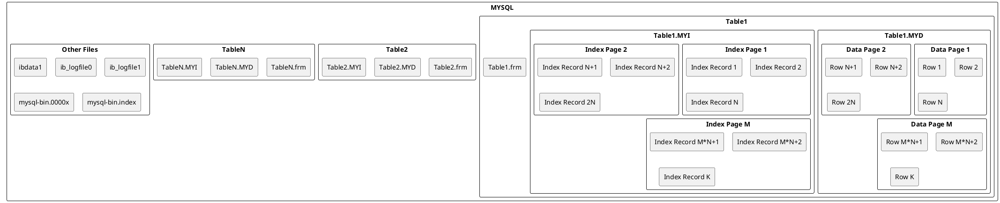

# mysql

```plantuml
@startuml
!pragma layout smetana
rectangle "MYSQL" {
    rectangle "Table1" {
        rectangle "Table1.frm"
        rectangle "Table1.MYD" {
            rectangle "Data Page 1" {
                rectangle "Row 1"
                rectangle "Row 2"
                rectangle "Row N"
            }
            rectangle "Data Page 2" {
                rectangle "Row N+1"
                rectangle "Row N+2"
                rectangle "Row 2N"
            }
            rectangle "Data Page M" {
                rectangle "Row M*N+1"
                rectangle "Row M*N+2"
                rectangle "Row K"
            }
        }
        rectangle "Table1.MYI" {
            rectangle "Index Page 1" {
                rectangle "Index Record 1"
                rectangle "Index Record 2"
                rectangle "Index Record N"
            }
            rectangle "Index Page 2" {
                rectangle "Index Record N+1"
                rectangle "Index Record N+2"
                rectangle "Index Record 2N"
            }
            rectangle "Index Page M" {
                rectangle "Index Record M*N+1"
                rectangle "Index Record M*N+2"
                rectangle "Index Record K"
            }
        }
    }
    rectangle "Table2" {
        rectangle "Table2.frm"
        rectangle "Table2.MYD" {
            rectangle "Data Page 1" {
                rectangle "Row 1"
                rectangle "Row 2"
                rectangle "Row N"
            }
            rectangle "Data Page 2" {
                rectangle "Row N+1"
                rectangle "Row N+2"
                rectangle "Row 2N"
            }
            rectangle "Data Page M" {
                rectangle "Row M*N+1"
                rectangle "Row M*N+2"
                rectangle "Row K"
            }
        }
        rectangle "Table2.MYI" {
            rectangle "Index Page 1" {
                rectangle "Index Record 1"
                rectangle "Index Record 2"
                rectangle "Index Record N"
            }
            rectangle "Index Page 2" {
                rectangle "Index Record N+1"
                rectangle "Index Record N+2"
                rectangle "Index Record 2N"
            }
            rectangle "Index Page M" {
                rectangle "Index Record M*N+1"
                rectangle "Index Record M*N+2"
                rectangle "Index Record K"
            }
        }
    }
    rectangle "TableN" {
        rectangle "TableN.frm"
        rectangle "TableN.MYD" {
            rectangle "Data Page 1" {
                rectangle "Row 1"
                rectangle "Row 2"
                rectangle "Row N"
            }
            rectangle "Data Page 2" {
                rectangle "Row N+1"
                rectangle "Row N+2"
                rectangle "Row 2N"
            }
            rectangle "Data Page M" {
                rectangle "Row M*N+1"
                rectangle "Row M*N+2"
                rectangle "Row K"
            }
        }
        rectangle "TableN.MYI" {
            rectangle "Index Page 1" {
                rectangle "Index Record 1"
                rectangle "Index Record 2"
                rectangle "Index Record N"
            }
            rectangle "Index Page 2" {
                rectangle "Index Record N+1"
                rectangle "Index Record N+2"
                rectangle "Index Record 2N"
            }
            rectangle "Index Page M" {
                rectangle "Index Record M*N+1"
                rectangle "Index Record M*N+2"
                rectangle "Index Record K"
            }
        }
    }
    rectangle "Other Files" {
        rectangle "ibdata1"
        rectangle "ib_logfile0"
        rectangle "ib_logfile1"
        rectangle "mysql-bin.0000x"
        rectangle "mysql-bin.index"
    }
}
@enduml
```