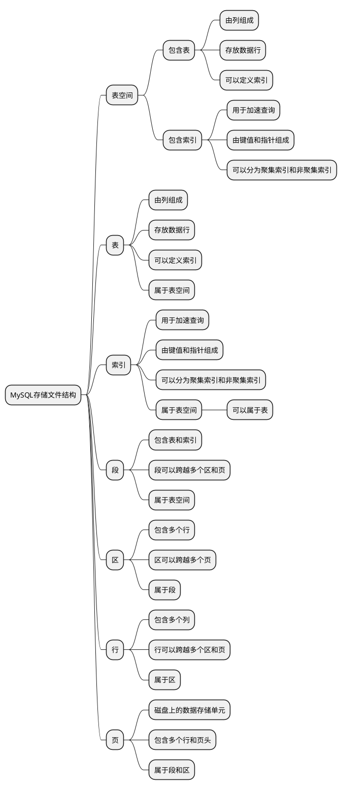

# mysql
## gpt

```plantuml
@startuml
!pragma layout smetana
rectangle "MYSQL" {
    rectangle "Table1" {
        rectangle "Table1.frm"
        rectangle "Table1.MYD" {
            rectangle "Data Page 1" {
                rectangle "Row 1"
                rectangle "Row 2"
                rectangle "Row N"
            }
            rectangle "Data Page 2" {
                rectangle "Row N+1"
                rectangle "Row N+2"
                rectangle "Row 2N"
            }
            rectangle "Data Page M" {
                rectangle "Row M*N+1"
                rectangle "Row M*N+2"
                rectangle "Row K"
            }
        }
        rectangle "Table1.MYI" {
            rectangle "Index Page 1" {
                rectangle "Index Record 1"
                rectangle "Index Record 2"
                rectangle "Index Record N"
            }
            rectangle "Index Page 2" {
                rectangle "Index Record N+1"
                rectangle "Index Record N+2"
                rectangle "Index Record 2N"
            }
            rectangle "Index Page M" {
                rectangle "Index Record M*N+1"
                rectangle "Index Record M*N+2"
                rectangle "Index Record K"
            }
        }
    }
    rectangle "Table2" {
        rectangle "Table2.frm"
        rectangle "Table2.MYD" {
            rectangle "Data Page 1" {
                rectangle "Row 1"
                rectangle "Row 2"
                rectangle "Row N"
            }
            rectangle "Data Page 2" {
                rectangle "Row N+1"
                rectangle "Row N+2"
                rectangle "Row 2N"
            }
            rectangle "Data Page M" {
                rectangle "Row M*N+1"
                rectangle "Row M*N+2"
                rectangle "Row K"
            }
        }
        rectangle "Table2.MYI" {
            rectangle "Index Page 1" {
                rectangle "Index Record 1"
                rectangle "Index Record 2"
                rectangle "Index Record N"
            }
            rectangle "Index Page 2" {
                rectangle "Index Record N+1"
                rectangle "Index Record N+2"
                rectangle "Index Record 2N"
            }
            rectangle "Index Page M" {
                rectangle "Index Record M*N+1"
                rectangle "Index Record M*N+2"
                rectangle "Index Record K"
            }
        }
    }
    rectangle "TableN" {
        rectangle "TableN.frm"
        rectangle "TableN.MYD" {
            rectangle "Data Page 1" {
                rectangle "Row 1"
                rectangle "Row 2"
                rectangle "Row N"
            }
            rectangle "Data Page 2" {
                rectangle "Row N+1"
                rectangle "Row N+2"
                rectangle "Row 2N"
            }
            rectangle "Data Page M" {
                rectangle "Row M*N+1"
                rectangle "Row M*N+2"
                rectangle "Row K"
            }
        }
        rectangle "TableN.MYI" {
            rectangle "Index Page 1" {
                rectangle "Index Record 1"
                rectangle "Index Record 2"
                rectangle "Index Record N"
            }
            rectangle "Index Page 2" {
                rectangle "Index Record N+1"
                rectangle "Index Record N+2"
                rectangle "Index Record 2N"
            }
            rectangle "Index Page M" {
                rectangle "Index Record M*N+1"
                rectangle "Index Record M*N+2"
                rectangle "Index Record K"
            }
        }
    }
    rectangle "Other Files" {
        rectangle "ibdata1"
        rectangle "ib_logfile0"
        rectangle "ib_logfile1"
        rectangle "mysql-bin.0000x"
        rectangle "mysql-bin.index"
    }
}
@enduml
```

## gpt

```plantuml
@startmindmap
* MySQL存储文件结构
** 表空间
*** 包含表
**** 由列组成
**** 存放数据行
**** 可以定义索引
*** 包含索引
**** 用于加速查询
**** 由键值和指针组成
**** 可以分为聚集索引和非聚集索引
** 表
*** 由列组成
*** 存放数据行
*** 可以定义索引
*** 属于表空间
** 索引
*** 用于加速查询
*** 由键值和指针组成
*** 可以分为聚集索引和非聚集索引
*** 属于表空间
**** 可以属于表
** 段
*** 包含表和索引
*** 段可以跨越多个区和页
*** 属于表空间
** 区
*** 包含多个行
*** 区可以跨越多个页
*** 属于段
** 行
*** 包含多个列
*** 行可以跨越多个区和页
*** 属于区
** 页
*** 磁盘上的数据存储单元
*** 包含多个行和页头
*** 属于段和区
@endmindmap

```