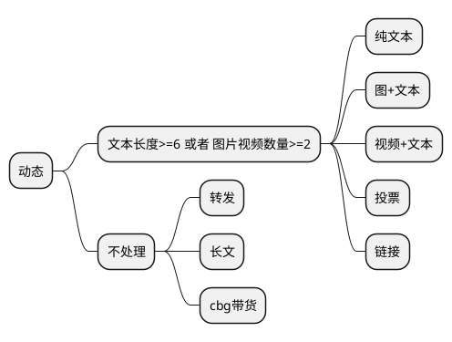

携手创作，共同成长！这是我参与「掘金日新计划 · 8 月更文挑战」的第28天，[点击查看活动详情](https://juejin.cn/post/7123120819437322247 "https://juejin.cn/post/7123120819437322247")

**引入 `MQ` 消息中间件最直接的目的：系统解耦以及流量控制（削峰填谷）**

*   **系统解耦：**  上下游系统之间的通信相互依赖，利用 `MQ` 消息队列可以隔离上下游环境变化带来的不稳定因素。
*   **流量控制：**  超高并发场景中，引入 `MQ` 可以实现流量 “削峰填谷” 的作用以及服务异步处理，不至于打崩服务。

**引入 `MQ` 同样带来其他问题：数据一致性。** 

> 在分布式系统中，如果两个节点之间存在数据同步，就会带来数据一致性的问题。 消息生产端发送消息到 `MQ` 再到消息消费端需要保证消息不丢失。


**所以在使用 `MQ` 消息队列时，需要考虑这 3 个问题：** 


*   如何知道有消息丢失？
*   哪些环节可能丢消息？
*   如何确保消息不丢失？

### （1）如何知道有消息丢失？

**如何感知消息是否丢失了？可总结如下：** 

1.  **他人反馈：**  运营、`PM` 反馈消息丢失。
2.  **监控报警：**  监控指定指标，即时报警人工调整。`Kafka` 集群异常、`Broker` 宕机、`Broker` 磁盘挂载问题、消费者异常导致消息积压等都会给用户直接感觉是消息丢失了。

**案例：舆情分析中数据采集同步**


*   `PM` 可自己下发采集调度指令，去采集特定数据。
*   `PM` 可通过 `ES` 近实时查询对应数据，若没相应数据可再次下发指令。

> 当感知消息丢失了，那就需要一种机制来检查消息是否丢失。

#### 检索消息

**运维工具有：** 

1.  查看 `Kafka` 消费位置：

```shell
# 查看某个topic的message数量
$ ./kafka-run-class.sh kafka.tools.GetOffsetShell --broker-list localhost:9092 --topic test_topic

# 查看consumer Group列表
$ ./kafka-consumer-groups.sh  --list  --bootstrap-server 192.168.88.108:9092

# 查看 offset 消费情况
$ ./kafka-consumer-groups.sh --bootstrap-server localhost:9092 --group console-consumer-1152 --describe
GROUP                 TOPIC           PARTITION  CURRENT-OFFSET  LOG-END-OFFSET  LAG             CONSUMER-ID                                                           HOST            CLIENT-ID
console-consumer-1152 test_topic      0          -               4               -               consumer-console-consumer-1152-1-2703ea2b-b62d-4cfd-8950-34e8c321b942 /127.0.0.1      consumer-console-consumer-1152-1

```

2.  利用工具：`Kafka Tools`


3.  其他可见化界面工具

  

### （2）哪些环节可能丢消息？

一条消息从生产到消费完成经历 3 个环节：消息生产者、消息中间件、消息消费者。


哪个环节都有可能出现消息丢失问题。

#### 1）生产端

**首先要认识到 `Kafka` 生产端发送消息流程：** 

> 调用 `send()` 方法时，不会立刻把消息发送出去，而是缓存起来，选择恰当时机把缓存里的消息划分成一批数据，通过 `Sender` 线程按批次发送给服务端 `Broker`。


**此环节丢失消息的场景有：**  即导致 `Producer` 消息没有发送成功

1.  **网络波动：**  生产者与服务端之间的链路不可达，发送超时。现象是：各端状态正常，但消费端就是没有消费消息，就像丢失消息一样。
    
    *   解决措施：重试 `props.put("retries", "10");`
2.  **不恰当配置：**  发送消息无 `ack` 确认; 发送消息失败无回调，无日志。
    
    *   解决措施：设置 `acks=1` 或者 `acks=all`。发送消息设置回调。
    
    ```java
    producer.send(new ProducerRecord<>(topic, messageKey, messageStr), 
                              new CallBack(){...});
    
    ```
    

**回顾下重要的参数：`acks`**

*   `acks=0`：不需要等待服务器的确认. 这是 `retries` 设置无效. 响应里来自服务端的 `offset` 总是 `-1`，`producer`只管发不管发送成功与否。延迟低，容易丢失数据。
*   `acks=1`：表示 `leader` 写入成功（但是并没有刷新到磁盘）后即向 `producer` 响应。延迟中等，一旦 `leader` 副本挂了，就会丢失数据。
*   `acks=all`：等待数据完成副本的复制, 等同于 `-1`. 假如需要保证消息不丢失, 需要使用该设置. 同时需要设置 `unclean.leader.election.enable` 为 `true`, 保证当 `ISR` 列表为空时, 选择其他存活的副本作为新的 `leader`.

  

#### 2）服务端

**先来了解下 `Kafka Broker` 写入数据的过程：** 

1.  `Broker` 接收到一批数据，会先写入内存 `PageCache`（`OS Cache`）中。
2.  操作系统会隔段时间把 `OS Cache` 中数据进行刷盘，这个过程会是 **「异步批量刷盘」**。


**这里就有个隐患，如果数据写入 `PageCache` 后 `Kafka Broker`宕机会怎样？机子宕机/掉电？**

*   **`Kafka Broker` 宕机：**  消息不会丢失。因为数据已经写入 `PageCache`，只等待操作系统刷盘即可。
*   **机子宕机/掉电：**  消息会丢失。因为数据仍在内存里，内存`RAM` 掉电后就会丢失数据。
    
    *   **解决方案：使用带蓄电池后备电源的缓存 `cache`，防止系统断电异常。** 
    
    > 1.  对比学习 `MySQL` 的 “双1” 策略，基本不使用这个策略，因为 “双1” 会导致频繁的 `I/O` 操作，也是最慢的一种。
    > 2.  对比学习 `Redis` 的 `AOF` 策略，默认且推荐的策略：**`Everysec`(`AOF_FSYNC_EVERYSEC`) 每一秒钟保存一次（默认）：** 。每个写命令执行完, 只是先把日志写到 `AOF` 文件的内存缓冲区, 每隔一秒把缓冲区中的内容写入磁盘。
    

**拓展：`Kafka` 日志刷盘机制**

```shell
# 推荐采用默认值，即不配置该配置，交由操作系统自行决定何时落盘，以提升性能。
# 针对 broker 配置：
log.flush.interval.messages=10000 # 日志落盘消息条数间隔，即每接收到一定条数消息，即进行log落盘。
log.flush.interval.ms=1000        # 日志落盘时间间隔，单位ms，即每隔一定时间，即进行log落盘。

# 针对 topic 配置：
flush.messages.flush.ms=1000  # topic下每1s刷盘
flush.messages=1              # topic下每个消息都落盘


# 查看 Linux 后台线程执行配置
$ sysctl -a | grep dirty
vm.dirty_background_bytes = 0
vm.dirty_background_ratio = 10      # 表示当脏页占总内存的的百分比超过这个值时，后台线程开始刷新脏页。
vm.dirty_bytes = 0
vm.dirty_expire_centisecs = 3000    # 表示脏数据多久会被刷新到磁盘上（30秒）。
vm.dirty_ratio = 20
vm.dirty_writeback_centisecs = 500  # 表示多久唤醒一次刷新脏页的后台线程（５秒）。
vm.dirtytime_expire_seconds = 43200

```

**`Broker` 的可靠性需要依赖其多副本机制：**  一般副本数 3 个（配置参数：`replication.factor=3`）

*   `Leader Partition` 副本：提供对外读写机制。
*   `Follower Partition` 副本：同步 `Leader` 数据。


**副本之间的数据同步也可能出现问题：数据丢失问题和数据不一致问题。** 

**解决方案：`ISR` 和 `Epoch` 机制** （具体可看之前的文章）

*   **`ISR`(`In-Sync Replicas`) ：**  当 `Leader` 宕机，可以从 `ISR` 中选择一个 `Follower` 作为 `Leader`。
    
*   **`Epoch` 机制：**  解决 `Leader` 副本高水位更新和 `Follower` 副本高水位更新在时间上是存在错配问题。
    
    > **`Tips`: `Kafka 0.11.x` 版本才引入 `leader epoch` 机制解决高水位机制弊端。** 
    

**对应需要的配置参数如下：** 

1.  **`acks=-1` 或者 `acks=all`：**  必须所有副本均同步到消息，才能表明消息发送成功。
    
2.  **`replication.factor >= 3`：**  副本数至少有 3 个。
    
3.  **`min.insync.replicas > 1`：**  代表消息至少写入 2个副本才算发送成功。前提需要 `acks=-1`。
    
    > 举个栗子：`Leader` 宕机了，至少要保证 `ISR` 中有一个 `Follower`，这样这个`Follwer`被选举为`Leader` 且不会丢失数据。
    > 
    > 公式：`replication.factor = min.insync.replicas + 1`
    
4.  **`unclean.leader.election.enable=false`：**  防止不在 `ISR` 中的 `Follower` 被选举为 `Leader`。
    
    > **Kafka 0.11.0.0版本开始默认 `unclean.leader.election.enable=false` **
    

  

#### 3）消费端

**消费端消息丢失场景有：** 

1.  **消息堆积：**  几个分区的消息都没消费，就跟丢消息一样。
    
    *   **解决措施：**  一般问题都出在消费端，尽量提高客户端的消费速度，消费逻辑另起线程进行处理。
2.  **自动提交：**  消费端拉下一批数据，正在处理中自动提交了 `offset`，这时候消费端宕机了; 重启后，拉到新一批数据，而上一批数据却没处理完。
    
    *   **解决措施：**  取消自动提交 `auto.commit = false`，改为手动 `ack`。
3.  **心跳超时，引发 `Rebalance`：**  客户端心跳超时，触发 `Rebalance`被踢出消费组。如果只有这一个客户端，那消息就不会被消费了。
    
    *   **解决措施：**  客户端版本升级至 `0.10.2` 以上版本。
    
    > **同时避免两次 `poll` 的间隔时间超过阈值：** 
    > 
    > *   `max.poll.records`：降低该参数值，建议远远小于 `<单个线程每秒消费的条数> * <消费线程的个数> * <max.poll.interval.ms>` 的积。
    > *   `max.poll.interval.ms`: 该值要大于 `<max.poll.records> / (<单个线程每秒消费的条数> * <消费线程的个数>)` 的值。
    

**案例：凡凡曾遇到数据同步时，消息中的文本需经过 `NLP` 的 `NER` 分析，再同步到 `ES`。** 

**这个过程的主要流程是：** 


1.  数据同步程序从 `Kafka` 中拉取消息。
2.  数据同步程序将消息内的文本发送的 `NER` 进行分析，得到特征数组。
3.  数据同步程序将消息同步给 `ES`。

**现象：线上数据同步程序运行一段时间后，消息就不消费了。** 

*   **排查日志：**  发现有 `Rebalance` 日志，怀疑是客户端消费太慢被踢出了消费组。
*   **本地测试：**  发现运行一段时间也会出现 `Rebalance`，且 `NLP`的`NER` 服务访问 `HTTP 500` 报错。
*   **得出结论：**  因`NER`服务异常，导致数据同步程序消费超时。**且当时客户端版本为 `v0.10.1`，`Consumer` 没有独立线程维持心跳，而是把心跳维持与 `poll` 接口耦合在一起，从而也会造成心跳超时。** 

**当时解决措施是：** 

1.  **`session.timeout.ms`：**  设置为 `25s`，当时没有升级客户端版本，怕带来其他问题。
2.  **熔断机制：**  增加 `Hystrix`，超过 3 次服务调用异常就熔断，保护客户端正常消费数据。

  

### （3）如何确保消息不丢失？

**掌握这些技能：** 

1.  熟悉消息从发送到消费的每个阶段
2.  监控报警 `Kafka` 集群
3.  熟悉方案 “MQ 可靠消息投递”

#### 怎么确保消息 100% 不丢失？

**到这，总结下：** 

1.  **生产端：** 

*   设置重试：`props.put("retries", "10");`
*   设置 `acks=all`
*   设置回调：`producer.send(msg, new CallBack(){...});`

2.  **`Broker`：** 

*   内存：使用带蓄电池后备电源的缓存 `cache`。
*   `Kafka` 版本 `0.11.x` 以上：支持 `Epoch` 机制。
*   **`replication.factor >= 3`：**  副本数至少有 3 个。
*   **`min.insync.replicas > 1`：**  代表消息至少写入 2个副本才算发送成功。前提需要 `acks=-1`。
*   **`unclean.leader.election.enable=false`：**  防止不在 `ISR` 中的 `Follower` 被选举为 `Leader`。

3.  **消费端**

*   客户端版本升级至 `0.10.2` 以上版本。
*   取消自动提交 `auto.commit = false`，改为手动 `ack`。
*   尽量提高客户端的消费速度，消费逻辑另起线程进行处理。本文主要讲解 Kafka 是什么、Kafka 的架构包括工作流程和存储机制，以及生产者和消费者，最终大家会掌握 Kafka 中最重要的概念，分别是 broker、producer、consumer、consumer group、topic、partition、replica、leader、follower，这是学会和理解 Kafka 的基础和必备内容。

1\. 定义
------

**Kafka** 是一个分布式的基于发布/订阅模式的消息队列（Message Queue），主要应用与大数据实时处理领域。

### 1.1 消息队列

Kafka 本质上是一个 MQ（Message Queue），使用消息队列的好处？ （面试会问）

1.  解耦：允许我们独立的扩展或修改队列两边的处理过程。
2.  可恢复性：即使一个处理消息的进程挂掉，加入队列中的消息仍然可以在系统恢复后被处理。
3.  缓冲：有助于解决生产消息和消费消息的处理速度不一致的情况。
4.  灵活性&峰值处理能力：不会因为突发的超负荷的请求而完全崩溃，消息队列能够使关键组件顶住突发的访问压力。
5.  异步通信：消息队列允许用户把消息放入队列但不立即处理它。

### 1.2 发布/订阅模式


一对多，生产者将消息发布到 topic 中，有多个消费者订阅该主题，发布到 topic 的消息会被所有订阅者消费，被消费的数据不会立即从 topic 清除。

2\. 架构
------


Kafka 存储的消息来自任意多被称为 Producer 生产者的进程。数据从而可以被发布到不同的 Topic 主题下的不同 Partition 分区。在一个分区内，这些消息被索引并连同时间戳存储在一起。其它被称为 Consumer 消费者的进程可以从分区订阅消息。Kafka 运行在一个由一台或多台服务器组成的集群上，并且分区可以跨集群结点分布。  
下面给出 Kafka 一些重要概念，让大家对 Kafka 有个整体的认识和感知，后面还会详细的解析每一个概念的作用以及更深入的原理。

*   **Producer：**  消息生产者，向 Kafka Broker 发消息的客户端。
*   **Consumer：**  消息消费者，从 Kafka Broker 取消息的客户端。
*   **Consumer Group：**  消费者组（CG），消费者组内每个消费者负责消费不同分区的数据，提高消费能力。一个分区只能由组内一个消费者消费，消费者组之间互不影响。所有的消费者都属于某个消费者组，即消费者组是逻辑上的一个订阅者。
*   **Broker：**  一台 Kafka 机器就是一个 broker。一个集群由多个 broker 组成。一个 broker 可以容纳多个 topic。
*   **Topic：**  可以理解为一个队列，topic 将消息分类，生产者和消费者面向的是同一个 topic。
*   **Partition：**  为了实现扩展性，提高并发能力，一个非常大的 topic 可以分布到多个 broker （即服务器）上，一个 topic 可以分为多个 partition，每个 partition 是一个 有序的队列。
*   **Replica：**  副本，为实现备份的功能，保证集群中的某个节点发生故障时，该节点上的 partition 数据不丢失，且 Kafka 仍然能够继续工作，Kafka 提供了副本机制，一个 topic 的每个分区都有若干个副本，一个 leader 和若干个 follower。
*   **Leader：**  每个分区多个副本的“主”副本，生产者发送数据的对象，以及消费者消费数据的对象，都是 leader。
*   **Follower：**  每个分区多个副本的“从”副本，实时从 leader 中同步数据，保持和 leader 数据的同步。leader 发生故障时，某个 follower 还会成为新的 leader。
*   **offset：**  消费者消费的位置信息，监控数据消费到什么位置，当消费者挂掉再重新恢复的时候，可以从消费位置继续消费。
*   **Zookeeper：**  Kafka 集群能够正常工作，需要依赖于 zookeeper，zookeeper 帮助 Kafka 存储和管理集群信息。

3 工作流程
------

Kafka集群将 Record 流存储在称为 topic 的类别中，每个记录由一个键、一个值和一个时间戳组成。**Kafka 是一个分布式流平台**，这到底是什么意思？

*   发布和订阅记录流，类似于消息队列或企业消息传递系统。
*   以容错的持久方式存储记录流。
*   处理记录流。


Kafka 中消息是以 topic 进行分类的，生产者生产消息，消费者消费消息，面向的都是同一个 topic。  
topic 是逻辑上的概念，而 partition 是物理上的概念，每个 partition 对应于一个 log 文件，该 log 文件中存储的就是 Producer 生产的数据。Producer 生产的数据会不断追加到该 log 文件末端，且每条数据都有自己的 offset。消费者组中的每个消费者，都会实时记录自己消费到了哪个 offset，以便出错恢复时，从上次的位置继续消费。

4 存储机制
------


由于生产者生产的消息会不断追加到 log 文件末尾，为防止 log 文件过大导致数据定位效率低下，Kafka 采取了**分片**和**索引**机制，将每个 partition 分为多个 segment，每个 segment 对应两个文件：“.index” 索引文件和 “.log” 数据文件。这些文件位于同一文件下，该文件夹的命名规则为：topic 名-分区号。例如，first 这个 topic 有三分分区，则其对应的文件夹为 first-0，first-1，first-2。

```shell
# ls /root/data/kafka/first-0        
00000000000000009014.index    
00000000000000009014.log
00000000000000009014.timeindex
00000000000000009014.snapshot   
leader-epoch-checkpoint

```

index 和 log 文件以当前 segment 的第一条消息的 offset 命名。下图为 index 文件 和 log 文件的结构示意图。  


“.index” 文件存储大量的索引信息，“.log” 文件存储大量的数据，索引文件中的元数据指向对应数据文件中 message 的物理偏移量。

5\. 生产者
-------

### 5.1 分区策略

#### 5.1.1 分区原因

*   方便在集群中扩展，每个 partition 可以通过调整以适应它所在的机器，而一个 topic 又可以有多个 partition 组成，因此可以以 partition 为单位读写了。
*   可以提高并发，因此可以以 partition 为单位读写了。

#### 5.1.2 分区原则

我们需要将 Producer 发送的数据封装成一个 ProducerRecord 对象。该对象需要指定一些参数：

*   topic：string 类型，NotNull
*   partition：int 类型，可选
*   timestamp：long 类型，可选
*   key：string类型，可选
*   value：string 类型，可选
*   headers：array 类型，Nullable

（1） 指明 partition 的情况下，直接将给定的 value 作为 partition 的值。  
（2） 没有指明 partition 但有 key 的情况下，将 key 的 hash 值与分区数取余得到 partition 值。  
（3） 既没有 partition 有没有 key 的情况下，第一次调用时随机生成一个整数（后面每次调用都在这个整数上自增），将这个值与可用的分区数取余，得到 partition 值，也就是常说的 round-robin 轮询算法。

### 5.2 数据可靠性保证

为保证 producer 发送的数据，能可靠地发送到指定的 topic，topic 的每个 partition 收到 producer 发送的数据后，都需要向 producer 发送 ack（acknowledge 确认收到），如果 producer 收到 ack，就会进行下一轮的发送，否则重新发送数据。  


#### 5.2.1 副本数据同步策略

**（1）何时发送 ack？**  
确保有 follower 与 leader 同步完成，leader 再发送 ack，这样才能保证 leader 挂掉之后，能在 follower 中选举出新的 leader 而不丢数据。  
**（2）多少个 follower 同步完成后发送 ack？**  
全部 follower 同步完成，再发送 ack。  


#### 5.2.2 ISR

采用第二种方案，所有 follower 完成同步，producer 才能继续发送数据，设想有一个 follower 因为某种原因出现故障，那 leader 就要一直等到它完成同步。这个问题怎么解决？  
leader维护了一个动态的 in-sync replica set（ISR）：和 leader 保持同步的 follower 集合。当 ISR 集合中的 follower 完成数据的同步之后，leader 就会给 follower 发送 ack。如果 follower 长时间未向 leader 同步数据，则该 follower 将被踢出 ISR 集合，该时间阈值由 replica.lag.time.max.ms 参数设定。leader 发生故障后，就会从 ISR 中选举出新的 leader。

#### 5.2.3 ack 应答机制

对于某些不太重要的数据，对数据的可靠性要求不是很高，能够容忍数据的少量丢失，所以没必要等 ISR 中的 follower 全部接受成功。  
所以 Kafka 为用户提供了三种可靠性级别，用户根据可靠性和延迟的要求进行权衡，选择以下的配置。  
**（1）ack 参数配置：** 

*   0：producer 不等待 broker 的 ack，这提供了最低延迟，broker 一收到数据还没有写入磁盘就已经返回，当 broker 故障时有可能丢失数据。
*   1：producer 等待 broker 的 ack，partition 的 leader 落盘成功后返回 ack，如果在 follower 同步成功之前 leader 故障，那么将会丢失数据。
*   -1（all）：producer 等待 broker 的 ack，partition 的 leader 和 follower 全部落盘成功后才返回 ack。但是在 broker 发送 ack 时，leader 发生故障，则会造成数据重复。


#### 5.2.4 故障处理细节


**LEO：每个副本最大的 offset。  
HW：消费者能见到的最大的 offset，ISR 队列中最小的 LEO。**   
**（1）Follower 故障**  
follower 发生故障后会被临时踢出 ISR 集合，待该 follower 恢复后，follower 会 读取本地磁盘记录的上次的 HW，并将 log 文件高于 HW 的部分截取掉，从 HW 开始向 leader 进行同步数据操作。等该 follower 的 LEO 大于等于该 partition 的 HW，即 follower 追上 leader 后，就可以重新加入 ISR 了。  
**（2）Leader 故障**  
leader 发生故障后，会从 ISR 中选出一个新的 leader，之后，为保证多个副本之间的数据一致性，其余的 follower 会先将各自的 log 文件高于 HW 的部分截掉，然后从新的 leader 同步数据。  
**注意：这只能保证副本之间的数据一致性，并不能保证数据不丢失或者不重复。** 

### 5.3 Exactly Once 语义

将服务器的 ACK 级别设置为-1，可以保证 producer 到 server 之间不会丢失数据，即 **At Least Once** 语义。相对的，将服务器 ACK 级别设置为0，可以保证生产者每条消息只会被发送一次，即**At Most Once** 语义。  
At Least Once 可以保证数据不丢失，但是不能保证数据不重复；相对的，At Most Once 可以保证数据不重复，但是不能保证数据不丢失。但是，对于一些非常重要的信息，比如交易数据，下游数据消费者要求数据既不重复也不丢失，即 **Exactly Once** 语义。  
0.11版本的 Kafka，引入了**幂等性**：producer 不论向 server 发送多少重复数据，server 端都只会持久化一条。即：

```null
At Least Once + 幂等性 = Exactly Once   

```

要启用幂等性，只需要将 producer 的参数中 `enable.idompotence` 设置为 `true` 即可。开启幂等性的 producer 在初始化时会被分配一个 PID，发往同一 partition 的消息会附带 Sequence Number。而 borker 端会对 <PID,Partition,SeqNumber> 做缓存，当具有相同主键的消息提交时，broker 只会持久化一条。  
但是 PID 重启后就会变化，同时不同的 partition 也具有不同主键，所以幂等性无法保证跨分区会话的 Exactly Once。

6\. 消费者
-------

### 6.1 消费方式

consumer 采用 pull（拉取）模式从 broker 中读取数据。  
consumer 采用 push（推送）模式，broker 给 consumer 推送消息的速率是由 broker 决定的，很难适应消费速率不同的消费者。它的目标是尽可能以最快速度传递消息，但是这样很容易造成 consumer 来不及处理消息，典型的表现就是拒绝服务以及网络拥塞。而 pull 模式则可以根据 consumer 的消费能力以适当的速率消费消息。  
pull 模式不足之处是，如果 Kafka 没有数据，消费者可能会陷入循环中，一直返回空数据。因为消费者从 broker 主动拉取数据，需要维护一个长轮询，针对这一点， Kafka 的消费者在消费数据时会传入一个时长参数 timeout，如果当前没有数据可供消费，consumer 会等待一段时间之后再返回，这段时长即为 timeout。

### 6.2 分区分配策略

一个 consumer group 中有多个 consumer，一个 topic 有多个 partition，所以必然会涉及到 partition 的分配问题，即确定哪个 partition 由哪个 consumer 来消费。  
Kafka 有两种分配策略，一个是 RoundRobin，一个是 Range，默认为range，当消费者组内消费者发生变化时，会触发分区分配策略（方法重新分配）。  
**（1） RoundRobin**  


RoundRobin 轮询方式将分区所有作为一个整体进行 hash 排序，消费者组内分配分区个数最大差别为1，是按照组来分的，可以解决多个消费者消费数据不均衡的问题。  
但是，当消费者组内订阅不同主题时，可能造成消费混乱，如下图所示，consumer0 订阅主题A，consumer1 订阅主题B，将 A、B主题的分区排序后分配给消费者组，TopicB 分区中的数据可能分配到 consumer0 中。


**（2）Range**


range 方式是按照主题来分的，不会产生轮询方式的消费混乱问题。  
但是，如下图所示，consumer0、consumer1 同时订阅了主题A和B，可能造成消息分配不对等问题，当消费者组内订阅的主题越多，分区分配可能越不均衡。


### 6.3 offset 的维护

由于 consumer 在消费过程中可能会出现断电宕机等故障，consumer 恢复后，需要从故障前的位置继续消费，所以 consumer 需要实时记录自己消费到了哪个 offset，以便故障恢复后继续消费。  
Kafka 0.9 版本之前，consumer 默认将 offset 保存在 Zookeeper 中，从 0.9 版本开始，consumer 默认将 offset 保存在 Kafka 一个内置的 topic 中，该 topic 为 \_\_consumer\_offsets。

刚刚和大家一起深入探讨了 Kafka 的架构，比较偏重理论和基础，这是掌握 Kafka 的必要内容，接下来我会以代码和实例的方式，更新 Kafka 有关 API 以及事务、拦截器、监控等高级篇，让大家彻底理解并且会用 Kafka。如果对你有帮助，点个赞相互鼓励一下吧~# Headline

> An awesome project.


### Section X

@[一些命令mark.md]



携手创作，共同成长！这是我参与「掘金日新计划 · 8 月更文挑战」的第28天，[点击查看活动详情](https://juejin.cn/post/7123120819437322247 "https://juejin.cn/post/7123120819437322247")

**引入 `MQ` 消息中间件最直接的目的：系统解耦以及流量控制（削峰填谷）**

*   **系统解耦：**  上下游系统之间的通信相互依赖，利用 `MQ` 消息队列可以隔离上下游环境变化带来的不稳定因素。
*   **流量控制：**  超高并发场景中，引入 `MQ` 可以实现流量 “削峰填谷” 的作用以及服务异步处理，不至于打崩服务。

**引入 `MQ` 同样带来其他问题：数据一致性。** 

> 在分布式系统中，如果两个节点之间存在数据同步，就会带来数据一致性的问题。 消息生产端发送消息到 `MQ` 再到消息消费端需要保证消息不丢失。


**所以在使用 `MQ` 消息队列时，需要考虑这 3 个问题：** 


*   如何知道有消息丢失？
*   哪些环节可能丢消息？
*   如何确保消息不丢失？

### （1）如何知道有消息丢失？

**如何感知消息是否丢失了？可总结如下：** 

1.  **他人反馈：**  运营、`PM` 反馈消息丢失。
2.  **监控报警：**  监控指定指标，即时报警人工调整。`Kafka` 集群异常、`Broker` 宕机、`Broker` 磁盘挂载问题、消费者异常导致消息积压等都会给用户直接感觉是消息丢失了。

**案例：舆情分析中数据采集同步**


*   `PM` 可自己下发采集调度指令，去采集特定数据。
*   `PM` 可通过 `ES` 近实时查询对应数据，若没相应数据可再次下发指令。

> 当感知消息丢失了，那就需要一种机制来检查消息是否丢失。

#### 检索消息

**运维工具有：** 

1.  查看 `Kafka` 消费位置：

```shell
# 查看某个topic的message数量
$ ./kafka-run-class.sh kafka.tools.GetOffsetShell --broker-list localhost:9092 --topic test_topic

# 查看consumer Group列表
$ ./kafka-consumer-groups.sh  --list  --bootstrap-server 192.168.88.108:9092

# 查看 offset 消费情况
$ ./kafka-consumer-groups.sh --bootstrap-server localhost:9092 --group console-consumer-1152 --describe
GROUP                 TOPIC           PARTITION  CURRENT-OFFSET  LOG-END-OFFSET  LAG             CONSUMER-ID                                                           HOST            CLIENT-ID
console-consumer-1152 test_topic      0          -               4               -               consumer-console-consumer-1152-1-2703ea2b-b62d-4cfd-8950-34e8c321b942 /127.0.0.1      consumer-console-consumer-1152-1

```

2.  利用工具：`Kafka Tools`


3.  其他可见化界面工具

  

### （2）哪些环节可能丢消息？

一条消息从生产到消费完成经历 3 个环节：消息生产者、消息中间件、消息消费者。


哪个环节都有可能出现消息丢失问题。

#### 1）生产端

**首先要认识到 `Kafka` 生产端发送消息流程：** 

> 调用 `send()` 方法时，不会立刻把消息发送出去，而是缓存起来，选择恰当时机把缓存里的消息划分成一批数据，通过 `Sender` 线程按批次发送给服务端 `Broker`。


**此环节丢失消息的场景有：**  即导致 `Producer` 消息没有发送成功

1.  **网络波动：**  生产者与服务端之间的链路不可达，发送超时。现象是：各端状态正常，但消费端就是没有消费消息，就像丢失消息一样。
    
    *   解决措施：重试 `props.put("retries", "10");`
2.  **不恰当配置：**  发送消息无 `ack` 确认; 发送消息失败无回调，无日志。
    
    *   解决措施：设置 `acks=1` 或者 `acks=all`。发送消息设置回调。
    
    ```java
    producer.send(new ProducerRecord<>(topic, messageKey, messageStr), 
                              new CallBack(){...});
    
    ```
    

**回顾下重要的参数：`acks`**

*   `acks=0`：不需要等待服务器的确认. 这是 `retries` 设置无效. 响应里来自服务端的 `offset` 总是 `-1`，`producer`只管发不管发送成功与否。延迟低，容易丢失数据。
*   `acks=1`：表示 `leader` 写入成功（但是并没有刷新到磁盘）后即向 `producer` 响应。延迟中等，一旦 `leader` 副本挂了，就会丢失数据。
*   `acks=all`：等待数据完成副本的复制, 等同于 `-1`. 假如需要保证消息不丢失, 需要使用该设置. 同时需要设置 `unclean.leader.election.enable` 为 `true`, 保证当 `ISR` 列表为空时, 选择其他存活的副本作为新的 `leader`.

  

#### 2）服务端

**先来了解下 `Kafka Broker` 写入数据的过程：** 

1.  `Broker` 接收到一批数据，会先写入内存 `PageCache`（`OS Cache`）中。
2.  操作系统会隔段时间把 `OS Cache` 中数据进行刷盘，这个过程会是 **「异步批量刷盘」**。


**这里就有个隐患，如果数据写入 `PageCache` 后 `Kafka Broker`宕机会怎样？机子宕机/掉电？**

*   **`Kafka Broker` 宕机：**  消息不会丢失。因为数据已经写入 `PageCache`，只等待操作系统刷盘即可。
*   **机子宕机/掉电：**  消息会丢失。因为数据仍在内存里，内存`RAM` 掉电后就会丢失数据。
    
    *   **解决方案：使用带蓄电池后备电源的缓存 `cache`，防止系统断电异常。** 
    
    > 1.  对比学习 `MySQL` 的 “双1” 策略，基本不使用这个策略，因为 “双1” 会导致频繁的 `I/O` 操作，也是最慢的一种。
    > 2.  对比学习 `Redis` 的 `AOF` 策略，默认且推荐的策略：**`Everysec`(`AOF_FSYNC_EVERYSEC`) 每一秒钟保存一次（默认）：** 。每个写命令执行完, 只是先把日志写到 `AOF` 文件的内存缓冲区, 每隔一秒把缓冲区中的内容写入磁盘。
    

**拓展：`Kafka` 日志刷盘机制**

```shell
# 推荐采用默认值，即不配置该配置，交由操作系统自行决定何时落盘，以提升性能。
# 针对 broker 配置：
log.flush.interval.messages=10000 # 日志落盘消息条数间隔，即每接收到一定条数消息，即进行log落盘。
log.flush.interval.ms=1000        # 日志落盘时间间隔，单位ms，即每隔一定时间，即进行log落盘。

# 针对 topic 配置：
flush.messages.flush.ms=1000  # topic下每1s刷盘
flush.messages=1              # topic下每个消息都落盘


# 查看 Linux 后台线程执行配置
$ sysctl -a | grep dirty
vm.dirty_background_bytes = 0
vm.dirty_background_ratio = 10      # 表示当脏页占总内存的的百分比超过这个值时，后台线程开始刷新脏页。
vm.dirty_bytes = 0
vm.dirty_expire_centisecs = 3000    # 表示脏数据多久会被刷新到磁盘上（30秒）。
vm.dirty_ratio = 20
vm.dirty_writeback_centisecs = 500  # 表示多久唤醒一次刷新脏页的后台线程（５秒）。
vm.dirtytime_expire_seconds = 43200

```

**`Broker` 的可靠性需要依赖其多副本机制：**  一般副本数 3 个（配置参数：`replication.factor=3`）

*   `Leader Partition` 副本：提供对外读写机制。
*   `Follower Partition` 副本：同步 `Leader` 数据。


**副本之间的数据同步也可能出现问题：数据丢失问题和数据不一致问题。** 

**解决方案：`ISR` 和 `Epoch` 机制** （具体可看之前的文章）

*   **`ISR`(`In-Sync Replicas`) ：**  当 `Leader` 宕机，可以从 `ISR` 中选择一个 `Follower` 作为 `Leader`。
    
*   **`Epoch` 机制：**  解决 `Leader` 副本高水位更新和 `Follower` 副本高水位更新在时间上是存在错配问题。
    
    > **`Tips`: `Kafka 0.11.x` 版本才引入 `leader epoch` 机制解决高水位机制弊端。** 
    

**对应需要的配置参数如下：** 

1.  **`acks=-1` 或者 `acks=all`：**  必须所有副本均同步到消息，才能表明消息发送成功。
    
2.  **`replication.factor >= 3`：**  副本数至少有 3 个。
    
3.  **`min.insync.replicas > 1`：**  代表消息至少写入 2个副本才算发送成功。前提需要 `acks=-1`。
    
    > 举个栗子：`Leader` 宕机了，至少要保证 `ISR` 中有一个 `Follower`，这样这个`Follwer`被选举为`Leader` 且不会丢失数据。
    > 
    > 公式：`replication.factor = min.insync.replicas + 1`
    
4.  **`unclean.leader.election.enable=false`：**  防止不在 `ISR` 中的 `Follower` 被选举为 `Leader`。
    
    > **Kafka 0.11.0.0版本开始默认 `unclean.leader.election.enable=false` **
    

  

#### 3）消费端

**消费端消息丢失场景有：** 

1.  **消息堆积：**  几个分区的消息都没消费，就跟丢消息一样。
    
    *   **解决措施：**  一般问题都出在消费端，尽量提高客户端的消费速度，消费逻辑另起线程进行处理。
2.  **自动提交：**  消费端拉下一批数据，正在处理中自动提交了 `offset`，这时候消费端宕机了; 重启后，拉到新一批数据，而上一批数据却没处理完。
    
    *   **解决措施：**  取消自动提交 `auto.commit = false`，改为手动 `ack`。
3.  **心跳超时，引发 `Rebalance`：**  客户端心跳超时，触发 `Rebalance`被踢出消费组。如果只有这一个客户端，那消息就不会被消费了。
    
    *   **解决措施：**  客户端版本升级至 `0.10.2` 以上版本。
    
    > **同时避免两次 `poll` 的间隔时间超过阈值：** 
    > 
    > *   `max.poll.records`：降低该参数值，建议远远小于 `<单个线程每秒消费的条数> * <消费线程的个数> * <max.poll.interval.ms>` 的积。
    > *   `max.poll.interval.ms`: 该值要大于 `<max.poll.records> / (<单个线程每秒消费的条数> * <消费线程的个数>)` 的值。
    

**案例：凡凡曾遇到数据同步时，消息中的文本需经过 `NLP` 的 `NER` 分析，再同步到 `ES`。** 

**这个过程的主要流程是：** 


1.  数据同步程序从 `Kafka` 中拉取消息。
2.  数据同步程序将消息内的文本发送的 `NER` 进行分析，得到特征数组。
3.  数据同步程序将消息同步给 `ES`。

**现象：线上数据同步程序运行一段时间后，消息就不消费了。** 

*   **排查日志：**  发现有 `Rebalance` 日志，怀疑是客户端消费太慢被踢出了消费组。
*   **本地测试：**  发现运行一段时间也会出现 `Rebalance`，且 `NLP`的`NER` 服务访问 `HTTP 500` 报错。
*   **得出结论：**  因`NER`服务异常，导致数据同步程序消费超时。**且当时客户端版本为 `v0.10.1`，`Consumer` 没有独立线程维持心跳，而是把心跳维持与 `poll` 接口耦合在一起，从而也会造成心跳超时。** 

**当时解决措施是：** 

1.  **`session.timeout.ms`：**  设置为 `25s`，当时没有升级客户端版本，怕带来其他问题。
2.  **熔断机制：**  增加 `Hystrix`，超过 3 次服务调用异常就熔断，保护客户端正常消费数据。

  

### （3）如何确保消息不丢失？

**掌握这些技能：** 

1.  熟悉消息从发送到消费的每个阶段
2.  监控报警 `Kafka` 集群
3.  熟悉方案 “MQ 可靠消息投递”

#### 怎么确保消息 100% 不丢失？

**到这，总结下：** 

1.  **生产端：** 

*   设置重试：`props.put("retries", "10");`
*   设置 `acks=all`
*   设置回调：`producer.send(msg, new CallBack(){...});`

2.  **`Broker`：** 

*   内存：使用带蓄电池后备电源的缓存 `cache`。
*   `Kafka` 版本 `0.11.x` 以上：支持 `Epoch` 机制。
*   **`replication.factor >= 3`：**  副本数至少有 3 个。
*   **`min.insync.replicas > 1`：**  代表消息至少写入 2个副本才算发送成功。前提需要 `acks=-1`。
*   **`unclean.leader.election.enable=false`：**  防止不在 `ISR` 中的 `Follower` 被选举为 `Leader`。

3.  **消费端**

*   客户端版本升级至 `0.10.2` 以上版本。
*   取消自动提交 `auto.commit = false`，改为手动 `ack`。
*   尽量提高客户端的消费速度，消费逻辑另起线程进行处理。本文主要讲解 Kafka 是什么、Kafka 的架构包括工作流程和存储机制，以及生产者和消费者，最终大家会掌握 Kafka 中最重要的概念，分别是 broker、producer、consumer、consumer group、topic、partition、replica、leader、follower，这是学会和理解 Kafka 的基础和必备内容。

1\. 定义
------

**Kafka** 是一个分布式的基于发布/订阅模式的消息队列（Message Queue），主要应用与大数据实时处理领域。

### 1.1 消息队列

Kafka 本质上是一个 MQ（Message Queue），使用消息队列的好处？ （面试会问）

1.  解耦：允许我们独立的扩展或修改队列两边的处理过程。
2.  可恢复性：即使一个处理消息的进程挂掉，加入队列中的消息仍然可以在系统恢复后被处理。
3.  缓冲：有助于解决生产消息和消费消息的处理速度不一致的情况。
4.  灵活性&峰值处理能力：不会因为突发的超负荷的请求而完全崩溃，消息队列能够使关键组件顶住突发的访问压力。
5.  异步通信：消息队列允许用户把消息放入队列但不立即处理它。

### 1.2 发布/订阅模式


一对多，生产者将消息发布到 topic 中，有多个消费者订阅该主题，发布到 topic 的消息会被所有订阅者消费，被消费的数据不会立即从 topic 清除。

2\. 架构
------


Kafka 存储的消息来自任意多被称为 Producer 生产者的进程。数据从而可以被发布到不同的 Topic 主题下的不同 Partition 分区。在一个分区内，这些消息被索引并连同时间戳存储在一起。其它被称为 Consumer 消费者的进程可以从分区订阅消息。Kafka 运行在一个由一台或多台服务器组成的集群上，并且分区可以跨集群结点分布。  
下面给出 Kafka 一些重要概念，让大家对 Kafka 有个整体的认识和感知，后面还会详细的解析每一个概念的作用以及更深入的原理。

*   **Producer：**  消息生产者，向 Kafka Broker 发消息的客户端。
*   **Consumer：**  消息消费者，从 Kafka Broker 取消息的客户端。
*   **Consumer Group：**  消费者组（CG），消费者组内每个消费者负责消费不同分区的数据，提高消费能力。一个分区只能由组内一个消费者消费，消费者组之间互不影响。所有的消费者都属于某个消费者组，即消费者组是逻辑上的一个订阅者。
*   **Broker：**  一台 Kafka 机器就是一个 broker。一个集群由多个 broker 组成。一个 broker 可以容纳多个 topic。
*   **Topic：**  可以理解为一个队列，topic 将消息分类，生产者和消费者面向的是同一个 topic。
*   **Partition：**  为了实现扩展性，提高并发能力，一个非常大的 topic 可以分布到多个 broker （即服务器）上，一个 topic 可以分为多个 partition，每个 partition 是一个 有序的队列。
*   **Replica：**  副本，为实现备份的功能，保证集群中的某个节点发生故障时，该节点上的 partition 数据不丢失，且 Kafka 仍然能够继续工作，Kafka 提供了副本机制，一个 topic 的每个分区都有若干个副本，一个 leader 和若干个 follower。
*   **Leader：**  每个分区多个副本的“主”副本，生产者发送数据的对象，以及消费者消费数据的对象，都是 leader。
*   **Follower：**  每个分区多个副本的“从”副本，实时从 leader 中同步数据，保持和 leader 数据的同步。leader 发生故障时，某个 follower 还会成为新的 leader。
*   **offset：**  消费者消费的位置信息，监控数据消费到什么位置，当消费者挂掉再重新恢复的时候，可以从消费位置继续消费。
*   **Zookeeper：**  Kafka 集群能够正常工作，需要依赖于 zookeeper，zookeeper 帮助 Kafka 存储和管理集群信息。

3 工作流程
------

Kafka集群将 Record 流存储在称为 topic 的类别中，每个记录由一个键、一个值和一个时间戳组成。**Kafka 是一个分布式流平台**，这到底是什么意思？

*   发布和订阅记录流，类似于消息队列或企业消息传递系统。
*   以容错的持久方式存储记录流。
*   处理记录流。


Kafka 中消息是以 topic 进行分类的，生产者生产消息，消费者消费消息，面向的都是同一个 topic。  
topic 是逻辑上的概念，而 partition 是物理上的概念，每个 partition 对应于一个 log 文件，该 log 文件中存储的就是 Producer 生产的数据。Producer 生产的数据会不断追加到该 log 文件末端，且每条数据都有自己的 offset。消费者组中的每个消费者，都会实时记录自己消费到了哪个 offset，以便出错恢复时，从上次的位置继续消费。

4 存储机制
------


由于生产者生产的消息会不断追加到 log 文件末尾，为防止 log 文件过大导致数据定位效率低下，Kafka 采取了**分片**和**索引**机制，将每个 partition 分为多个 segment，每个 segment 对应两个文件：“.index” 索引文件和 “.log” 数据文件。这些文件位于同一文件下，该文件夹的命名规则为：topic 名-分区号。例如，first 这个 topic 有三分分区，则其对应的文件夹为 first-0，first-1，first-2。

```shell
# ls /root/data/kafka/first-0        
00000000000000009014.index    
00000000000000009014.log
00000000000000009014.timeindex
00000000000000009014.snapshot   
leader-epoch-checkpoint

```

index 和 log 文件以当前 segment 的第一条消息的 offset 命名。下图为 index 文件 和 log 文件的结构示意图。  


“.index” 文件存储大量的索引信息，“.log” 文件存储大量的数据，索引文件中的元数据指向对应数据文件中 message 的物理偏移量。

5\. 生产者
-------

### 5.1 分区策略

#### 5.1.1 分区原因

*   方便在集群中扩展，每个 partition 可以通过调整以适应它所在的机器，而一个 topic 又可以有多个 partition 组成，因此可以以 partition 为单位读写了。
*   可以提高并发，因此可以以 partition 为单位读写了。

#### 5.1.2 分区原则

我们需要将 Producer 发送的数据封装成一个 ProducerRecord 对象。该对象需要指定一些参数：

*   topic：string 类型，NotNull
*   partition：int 类型，可选
*   timestamp：long 类型，可选
*   key：string类型，可选
*   value：string 类型，可选
*   headers：array 类型，Nullable

（1） 指明 partition 的情况下，直接将给定的 value 作为 partition 的值。  
（2） 没有指明 partition 但有 key 的情况下，将 key 的 hash 值与分区数取余得到 partition 值。  
（3） 既没有 partition 有没有 key 的情况下，第一次调用时随机生成一个整数（后面每次调用都在这个整数上自增），将这个值与可用的分区数取余，得到 partition 值，也就是常说的 round-robin 轮询算法。

### 5.2 数据可靠性保证

为保证 producer 发送的数据，能可靠地发送到指定的 topic，topic 的每个 partition 收到 producer 发送的数据后，都需要向 producer 发送 ack（acknowledge 确认收到），如果 producer 收到 ack，就会进行下一轮的发送，否则重新发送数据。  


#### 5.2.1 副本数据同步策略

**（1）何时发送 ack？**  
确保有 follower 与 leader 同步完成，leader 再发送 ack，这样才能保证 leader 挂掉之后，能在 follower 中选举出新的 leader 而不丢数据。  
**（2）多少个 follower 同步完成后发送 ack？**  
全部 follower 同步完成，再发送 ack。  


#### 5.2.2 ISR

采用第二种方案，所有 follower 完成同步，producer 才能继续发送数据，设想有一个 follower 因为某种原因出现故障，那 leader 就要一直等到它完成同步。这个问题怎么解决？  
leader维护了一个动态的 in-sync replica set（ISR）：和 leader 保持同步的 follower 集合。当 ISR 集合中的 follower 完成数据的同步之后，leader 就会给 follower 发送 ack。如果 follower 长时间未向 leader 同步数据，则该 follower 将被踢出 ISR 集合，该时间阈值由 replica.lag.time.max.ms 参数设定。leader 发生故障后，就会从 ISR 中选举出新的 leader。

#### 5.2.3 ack 应答机制

对于某些不太重要的数据，对数据的可靠性要求不是很高，能够容忍数据的少量丢失，所以没必要等 ISR 中的 follower 全部接受成功。  
所以 Kafka 为用户提供了三种可靠性级别，用户根据可靠性和延迟的要求进行权衡，选择以下的配置。  
**（1）ack 参数配置：** 

*   0：producer 不等待 broker 的 ack，这提供了最低延迟，broker 一收到数据还没有写入磁盘就已经返回，当 broker 故障时有可能丢失数据。
*   1：producer 等待 broker 的 ack，partition 的 leader 落盘成功后返回 ack，如果在 follower 同步成功之前 leader 故障，那么将会丢失数据。
*   -1（all）：producer 等待 broker 的 ack，partition 的 leader 和 follower 全部落盘成功后才返回 ack。但是在 broker 发送 ack 时，leader 发生故障，则会造成数据重复。


#### 5.2.4 故障处理细节


**LEO：每个副本最大的 offset。  
HW：消费者能见到的最大的 offset，ISR 队列中最小的 LEO。**   
**（1）Follower 故障**  
follower 发生故障后会被临时踢出 ISR 集合，待该 follower 恢复后，follower 会 读取本地磁盘记录的上次的 HW，并将 log 文件高于 HW 的部分截取掉，从 HW 开始向 leader 进行同步数据操作。等该 follower 的 LEO 大于等于该 partition 的 HW，即 follower 追上 leader 后，就可以重新加入 ISR 了。  
**（2）Leader 故障**  
leader 发生故障后，会从 ISR 中选出一个新的 leader，之后，为保证多个副本之间的数据一致性，其余的 follower 会先将各自的 log 文件高于 HW 的部分截掉，然后从新的 leader 同步数据。  
**注意：这只能保证副本之间的数据一致性，并不能保证数据不丢失或者不重复。** 

### 5.3 Exactly Once 语义

将服务器的 ACK 级别设置为-1，可以保证 producer 到 server 之间不会丢失数据，即 **At Least Once** 语义。相对的，将服务器 ACK 级别设置为0，可以保证生产者每条消息只会被发送一次，即**At Most Once** 语义。  
At Least Once 可以保证数据不丢失，但是不能保证数据不重复；相对的，At Most Once 可以保证数据不重复，但是不能保证数据不丢失。但是，对于一些非常重要的信息，比如交易数据，下游数据消费者要求数据既不重复也不丢失，即 **Exactly Once** 语义。  
0.11版本的 Kafka，引入了**幂等性**：producer 不论向 server 发送多少重复数据，server 端都只会持久化一条。即：

```null
At Least Once + 幂等性 = Exactly Once   

```

要启用幂等性，只需要将 producer 的参数中 `enable.idompotence` 设置为 `true` 即可。开启幂等性的 producer 在初始化时会被分配一个 PID，发往同一 partition 的消息会附带 Sequence Number。而 borker 端会对 <PID,Partition,SeqNumber> 做缓存，当具有相同主键的消息提交时，broker 只会持久化一条。  
但是 PID 重启后就会变化，同时不同的 partition 也具有不同主键，所以幂等性无法保证跨分区会话的 Exactly Once。

6\. 消费者
-------

### 6.1 消费方式

consumer 采用 pull（拉取）模式从 broker 中读取数据。  
consumer 采用 push（推送）模式，broker 给 consumer 推送消息的速率是由 broker 决定的，很难适应消费速率不同的消费者。它的目标是尽可能以最快速度传递消息，但是这样很容易造成 consumer 来不及处理消息，典型的表现就是拒绝服务以及网络拥塞。而 pull 模式则可以根据 consumer 的消费能力以适当的速率消费消息。  
pull 模式不足之处是，如果 Kafka 没有数据，消费者可能会陷入循环中，一直返回空数据。因为消费者从 broker 主动拉取数据，需要维护一个长轮询，针对这一点， Kafka 的消费者在消费数据时会传入一个时长参数 timeout，如果当前没有数据可供消费，consumer 会等待一段时间之后再返回，这段时长即为 timeout。

### 6.2 分区分配策略

一个 consumer group 中有多个 consumer，一个 topic 有多个 partition，所以必然会涉及到 partition 的分配问题，即确定哪个 partition 由哪个 consumer 来消费。  
Kafka 有两种分配策略，一个是 RoundRobin，一个是 Range，默认为range，当消费者组内消费者发生变化时，会触发分区分配策略（方法重新分配）。  
**（1） RoundRobin**  


RoundRobin 轮询方式将分区所有作为一个整体进行 hash 排序，消费者组内分配分区个数最大差别为1，是按照组来分的，可以解决多个消费者消费数据不均衡的问题。  
但是，当消费者组内订阅不同主题时，可能造成消费混乱，如下图所示，consumer0 订阅主题A，consumer1 订阅主题B，将 A、B主题的分区排序后分配给消费者组，TopicB 分区中的数据可能分配到 consumer0 中。


**（2）Range**


range 方式是按照主题来分的，不会产生轮询方式的消费混乱问题。  
但是，如下图所示，consumer0、consumer1 同时订阅了主题A和B，可能造成消息分配不对等问题，当消费者组内订阅的主题越多，分区分配可能越不均衡。


### 6.3 offset 的维护

由于 consumer 在消费过程中可能会出现断电宕机等故障，consumer 恢复后，需要从故障前的位置继续消费，所以 consumer 需要实时记录自己消费到了哪个 offset，以便故障恢复后继续消费。  
Kafka 0.9 版本之前，consumer 默认将 offset 保存在 Zookeeper 中，从 0.9 版本开始，consumer 默认将 offset 保存在 Kafka 一个内置的 topic 中，该 topic 为 \_\_consumer\_offsets。

刚刚和大家一起深入探讨了 Kafka 的架构，比较偏重理论和基础，这是掌握 Kafka 的必要内容，接下来我会以代码和实例的方式，更新 Kafka 有关 API 以及事务、拦截器、监控等高级篇，让大家彻底理解并且会用 Kafka。如果对你有帮助，点个赞相互鼓励一下吧~# Headline

> An awesome project.


### Section X

@[一些命令mark.md]

```plantuml
@startmindmap
* 动态
** 文本长度>=6 或者 图片视频数量>=2
*** 纯文本
*** 图+文本
*** 视频+文本
*** 投票
*** 链接

** 不处理
*** 转发
*** 长文
*** cbg带货

@endmindmap
```## cpu查看软中断
``
	cat  /proc/softirqs

``
``
![[Pasted image 20230329101920.png]]
``
你可以看到，每一个 CPU 都有自己对应的不同类型软中断的**累计运行次数**，有 3 点需要注意下。

第一点，要注意第一列的内容，它是代表着软中断的类型，在我的系统里，软中断包括了 10 个类型，分别对应不同的工作类型，比如 `NET_RX` 表示网络接收中断，`NET_TX` 表示网络发送中断、`TIMER` 表示定时中断、`RCU` 表示 RCU 锁中断、`SCHED` 表示内核调度中断。

第二点，要注意同一种类型的软中断在不同 CPU 的分布情况，正常情况下，同一种中断在不同 CPU 上的累计次数相差不多，比如我的系统里，`NET_RX` 在 CPU0 、CPU1、CPU2、CPU3 上的中断次数基本是同一个数量级，相差不多。
## 查看软中断的变化速率
``
watch -d cat /proc/softirqs
``1.Kafka消费者概述
------------

   1.**消息消费者，向 Kafka broker 取消息的客户端**

**2.****与生产者对应的是消费者， 应用程序可以通过KafkaConsumer来订阅主题， 并从订阅的topic中拉取消息。 每个消费者都有一 个对应的消费组。 当消息发布到主题后， 只会被投递给订阅它的每个消费组中的一 个消费者**

**3.单播消费:一条消息只能被某一个消费者消费的模式，类似queue模式，只需让所有消费者在同一个消费组里即可**

**4.多播消费:一条消息能被多个消费者消费的模式，类似publish-subscribe模式费，针对Kafka同一条消息只能被同一个消费组下的某一个消费者消费的特性，**

**要实现多播只要保证这些消费者属于不同的消费组即可**

**1.1**Kafka 消费方式
-----------------

    **1. pull（拉）模 式：consumer采用从broker中主动拉取数据, consumer **可以根据**的消费能力以适当的速率消费消息。Kafka采用这种方式，缺点：如 果Kafka没有数据，消费者可能会陷入循环中，一直返回空数据**。

**2.push（推）模式：Kafka没有采用这种方式，因为由broker决定消息发送速率，而且每个消费者的消费速率也不同，所以很难适应所有消费者的消费速率**。

例如推送的速度是50m/s，Consumer1、Consumer2就来不及处理消息

    3\. **对于 Kafka 而言，pull 模式更合适，它可简化 broker 的设计，consumer 可自主控制消费消息的速率，同时 consumer 可以自己控制消费方式——即可批量消费也可逐条消费，同时还能选择不同的提交方式从而实现不同的传输语义**

    4.**pull 模式不足之处是，如果 kafka 没有数据，消费者可能会陷入循环中，一直等待数据到达。为了避免这种情况，可以在拉取请求中 设置允许消费者请求在等待数据到达的“长轮询”中进行阻塞（并且可选地等待到给定的字节数，以确保大的传输大小）**


2\. 消费者总体工作流程
-------------

      

3.消费者组原理 
---------

　　**kafka使用一种消费者组（Consumer Group）机制，就同时实现了传统消息引擎系统的两大模型：如果所有的消费者实例都属于一个消费者组那就是点对点模型，如果所有消费者实例各自是独立的消费者那就是发布订阅模型。** 

###   3.1消费者组**Consumer Group**

    **1.****消费者组，由多个consumer组成。形成一个消费者组的条件，是所有消费者的groupid相同**

**2.**每个Consumer属于一个特定的Consumer Group,并且每个消费者Consumer都有一个group id，**group id相同的多个消费者自动成为一个消费者组;******

**3.**所有的消费者都属于某个消费者组，对于某个分区而言,即消费者组是逻辑上的一个订阅者****

********

    4.**消费者组内每个消费者负责消费不同分区的数据，一个分区只能由一个组内消费者消费；消费者组之间互不****影响**

**5.**一条消息可以被多个不同的Consumer Group消费，但是一个Consumer Group中只能有一个Consumer能够消费该消息****

 **6.如果向消费组中添加更多的消费者，超过主题分区数量，则有一部分消费者就会闲置，不会接收任何消息**

    

###  3.2消费者组初始化流程

####     3.2.1  coordinator的选择

**1.coordinator：辅助实现消费者组的初始化和分区的分配**。 

2.**每个consumer group都会选择一个broker作为自己的组协调器coordinator，负责监控这个消费组里的所有消费者的心跳，以及判断是否宕机，然后触发消费者rebalance(再平衡)**

       2.**coordinator选择公式**:******coordinator节点选择 = groupid的hashcode值 % 50（ \_\_consumer\_offsets的分区数量）**

　　3.例如:.groupid的hashcode值 = 1，1% 50 = 1，那么\_\_consumer\_offsets 主题的1号分区，在哪个broker上，就选择这个节点的coordinator作为这个消费者组的老大。消费者组下的所有的消费者提交offset的时候就往这个分区去提交offset。

**4.consumer group中的每个consumer启动时会向kafka集群中的某个节点发送 FindCoordinatorRequest 请求来查找对应的组协调器GroupCoordinator，并跟其建立网络连接**

####        3.2.2**消费者组的初始化和分区的分配**

**1.根据**coordinator选择公式**选择 **协调器******coordinator节点 ,然后**每个consumer启动时会向kafka集群中的某个节点发送 FindCoordinatorRequest 请求来查找对应的组协调器GroupCoordinator，并跟其建立网络连接****

**2.在成功加入到消费组之后,每个consumer都给coordinator发送JoinGroup请求,**

**3.由coordinator节点选出一个consumer作为消费者leader 节点.**

**4.然后coordinator节点把所有消费者以及把要消费的topic情况发送给leader 消费者**

**5.消费者leader会负责制定消费方案(消费者如何消费消息,消费那个分区等信息),把消费方案发给coordinator**

**6.Coordinator就把消费方案下发给各个consumer**

**7.每个消费者都会和coordinator保持心跳（默认3s），一旦超时（session.timeout.ms=45s），该消费者会被移除，并触发再平衡；或者消费者处理消息的时间过长（max.poll.interval.ms5分钟），也****会触发再平横.**

************


    **1.Fetch.min.bytes：每批次最小抓取大小，默认1字节**

**2.fetch.max.wait.ms：一批数据最小值未达到的超时时间，默认500ms**

**3.Fetch.max.bytes：每批次最大抓取大小，默认50m**

**4.Max.poll.records：一次拉取数据返回消息的最大条数，默认500条**

**5.auto.offset.reset：关乎kafka数据的读取，是一个非常重要的设置。常用的二个值是latest和earliest，默认是latest。** 

**1)latest(默认) ：只消费自己启动之后发送到主题的消息,earliest：第一次从头开始消费，以后按照消费offset记录继续消费，**

**2)auto.offset.reset最好不要设置为latest,因为如果分区内的数据未被消费过,这时消费者上线.会导致消费者无法消费到前面的数据,(当然也得看应用场景，如果认为这种情况的数据就该丢失，那当我没说）**

**3)auto.offset.reset设置为earliest时，可能会有重复消费的问题，这就需要消费者端做数据去重处理**

###  3.3消费者常用API


import org.apache.kafka.clients.consumer.ConsumerConfig; import org.apache.kafka.clients.consumer.ConsumerRecord; import org.apache.kafka.clients.consumer.ConsumerRecords; import org.apache.kafka.clients.consumer.KafkaConsumer; import org.apache.kafka.common.serialization.StringDeserializer; import java.time.Duration; import java.util.Arrays; import java.util.Properties; public class MsgConsumer { private final static String TOPIC_NAME = "my-replicated-topic"; private final static String CONSUMER\_GROUP\_NAME = "testGroup"; public static void main(String\[\] args) {
        Properties props = new Properties();
        props.put(ConsumerConfig.BOOTSTRAP\_SERVERS\_CONFIG, "192.168.65.60:9092,192.168.65.60:9093,192.168.65.60:9094"); **// 消费分组名
        props.put(ConsumerConfig.GROUP\_ID\_CONFIG, CONSUMER\_GROUP\_NAME);**

　**// 修改分区分配策略**

**properties.put(ConsumerConfig.PARTITION\_ASSIGNMENT\_STRATEGY_CONFIG, "org.apache.kafka.clients.consumer.RoundRobinAssignor");**

 **// 是否自动提交offset，默认就是true
        props.put(ConsumerConfig.ENABLE\_AUTO\_COMMIT_CONFIG, "true");
        // 自动提交offset的间隔时间
        props.put(ConsumerConfig.AUTO\_COMMIT\_INTERVAL\_MS\_CONFIG, "1000");
        //props.put(ConsumerConfig.ENABLE\_AUTO\_COMMIT_CONFIG, "false");
        /*
        当消费主题的是一个新的消费组，或者指定offset的消费方式，offset不存在，那么应该如何消费
        latest(默认) ：只消费自己启动之后发送到主题的消息
        earliest：第一次从头开始消费，以后按照消费offset记录继续消费，这个需要区别于consumer.seekToBeginning(每次都从头开始消费)
        */
        //props.put(ConsumerConfig.AUTO\_OFFSET\_RESET_CONFIG, "earliest");
      /*
      consumer给broker发送心跳的间隔时间，broker接收到心跳如果此时有rebalance发生会通过心跳响应将
      rebalance方案下发给consumer，这个时间可以稍微短一点
      */
        props.put(ConsumerConfig.HEARTBEAT\_INTERVAL\_MS_CONFIG, 1000);
        /*
        服务端broker多久感知不到一个consumer心跳就认为他故障了，会将其踢出消费组，
        对应的Partition也会被重新分配给其他consumer，默认是10秒
        */
        props.put(ConsumerConfig.SESSION\_TIMEOUT\_MS_CONFIG, 10 * 1000);
        //一次poll最大拉取消息的条数，如果消费者处理速度很快，可以设置大点，如果处理速度一般，可以设置小点
        props.put(ConsumerConfig.MAX\_POLL\_RECORDS_CONFIG, 500);
        /*
        如果两次poll操作间隔超过了这个时间，broker就会认为这个consumer处理能力太弱，
        会将其踢出消费组，将分区分配给别的consumer消费
        */** props.put(ConsumerConfig.MAX\_POLL\_INTERVAL\_MS\_CONFIG, 30 * 1000);
        props.put(ConsumerConfig.KEY\_DESERIALIZER\_CLASS_CONFIG, StringDeserializer.class.getName());
        props.put(ConsumerConfig.VALUE\_DESERIALIZER\_CLASS_CONFIG, StringDeserializer.class.getName());
        KafkaConsumer<String, String> consumer = new KafkaConsumer<String, String>(props);

        consumer.subscribe(Arrays.asList(TOPIC_NAME)); **// 消费指定分区 //consumer.assign(Arrays.asList(new TopicPartition(TOPIC_NAME, 0))); //消息回溯消费
        /*consumer.assign(Arrays.asList(new TopicPartition(TOPIC_NAME, 0)));
        consumer.seekToBeginning(Arrays.asList(new TopicPartition(TOPIC_NAME, 0)));*******/

        //指定offset消费
        /*consumer.assign(Arrays.asList(new TopicPartition(TOPIC_NAME, 0)));
        consumer.seek(new TopicPartition(TOPIC_NAME, 0), 10);*/

        //从指定时间点开始消费
        /*List<PartitionInfo> topicPartitions = consumer.partitionsFor(TOPIC_NAME);
        //从1小时前开始消费
        long fetchDataTime = new Date().getTime() - 1000 * 60 * 60;
        Map<TopicPartition, Long> map = new HashMap<>();
        for (PartitionInfo par : topicPartitions) {
            map.put(new TopicPartition(topicName, par.partition()), fetchDataTime);
        }
        Map<TopicPartition, OffsetAndTimestamp> parMap = consumer.offsetsForTimes(map);
        for (Map.Entry<TopicPartition, OffsetAndTimestamp> entry : parMap.entrySet()) {
            TopicPartition key = entry.getKey();
            OffsetAndTimestamp value = entry.getValue();
            if (key == null || value == null) continue;
            Long offset = value.offset();
            System.out.println("partition-" + key.partition() + "|offset-" + offset);
            System.out.println();
            //根据消费里的timestamp确定offset
            if (value != null) {
                consumer.assign(Arrays.asList(key));
                consumer.seek(key, offset);
            }
        }*/

        while (true) { /* \* poll() API 是拉取消息的长轮询 */ ConsumerRecords<String, String> records = consumer.poll(Duration.ofMillis(1000)); for (ConsumerRecord<String, String> record : records) {
                System.out.printf("收到消息：partition = %d,offset = %d, key = %s, value = %s%n", record.partition(),
                        record.offset(), record.key(), record.value());
            } /*if (records.count() > 0) {
                // 手动同步提交offset，当前线程会阻塞直到offset提交成功
                // 一般使用同步提交，因为提交之后一般也没有什么逻辑代码了
                consumer.commitSync();

                // 手动异步提交offset，当前线程提交offset不会阻塞，可以继续处理后面的程序逻辑
                consumer.commitAsync(new OffsetCommitCallback() {
                    @Override
                    public void onComplete(Map<TopicPartition, OffsetAndMetadata> offsets, Exception exception) {
                        if (exception != null) {
                            System.err.println("Commit failed for " + offsets);
                            System.err.println("Commit failed exception: " + exception.getStackTrace());
                        }
                    }
                });

            }*/ }
    }
}


###  3.4 生产经验——分区的分配以及再平衡

**1、一个consumer group中有多个consumer组成，一个 topic有多个partition组成，现在的问题是，到底由哪个consumer来消费哪个partition的数据,所以就需要分区的分配以及再平衡**

#### **3.4.1**分区分配策略

      **1.****Kafka有四种主流的分区分配策略： Range、RoundRobin、Sticky、CooperativeSticky。可以通过配置参数partition.assignment.strategy，修改消费者与订阅主题之间的分区分配策略**

**2.默认策略是Range + CooperativeSticky。Kafka可以同时使用多个分区分配策略**

#### **3.4.2**分区分配策略之Range 以及再平衡

         1.**Range 是对每个 topic 而言的。首先对同一个 topic 里面的分区按照序号进行排序，并对消费者按照字母顺序进行排序**

 **2.****通过 partitions数/consumer数 来决定每个消费者应该消费几个分区。如果除不尽，那么前面几个消费者将会多消费 1 个分区**

**3.例如1:**假如现在有 7 个分区，3 个消费者，排序后的分区将会是0,1,2,3,4,5,6；消费者排序完之后将会是C0,C1,C2,

　　  4.7/3 = 2 余 1 ，除不尽，那么 消费者 C0 便会多消费 1 个分区。假如 8/3=2余2，除不尽，那么C0和C1分别多消费一个

         

    5**.注意：如果只是针对 1 个 topic 而言，C0消费者多消费1个分区影响不是很大。但是如果有 N 多个 topic，那么针对每个 topic，消费者 C0都将多消费 1 个分区，topic越多，C0消费的分区会比其他消费者明显多消费 N 个分区**。**容易产生数据倾斜**

 　　**5.分区分配策略Range的再平衡案例**

（1）停止掉 0 号消费者，快速重新发送消息观看结果（45s 以内,越快越好）**45s(session.timeout.ms=45s）消费者都会和coordinator保持心跳（默认3s）不能超过45s，一旦超时该消费者会被移除**

　　　　　　结果:1 号消费者消费到 3、4 号分区的数据。2 号消费者消费到 5、6 号分区的数据; 0 号消费者的任务会整体被分配到 1 号消费者或者 2 号消费者

  **说明：0 号消费者挂掉后，消费者组需要按照超时时间 45s 来判断它是否退出，所以需要等待，时间到了 45s 后，判断它真的退出就会把任务分配给其他 broker 执行。** 

****(2)****再次重新发送消息观看结果（45s 以后）

                   结果:1 号消费者：消费到 0、1、2、3 号分区数据,2 号消费者：消费到 4、5、6 号分区数据。

**说明：消费者 0 已经被踢出消费者组，所以重新按照 range 方式分配。** 

#### **3.4.3**分区分配策略之RoundRobin以及再平衡

      **1.RoundRobin 针对集群中所有Topic而言,RoundRobin 轮询分区策略，是把所有的 partition 和所有的consumer 都列出来，然后按照 hashcode 进行排序，最后通过轮询算法来分配 partition 给到各个消费者**

   

 **2.分区分配策略RoundRobin的再平衡案例**

    （1）停止掉 0 号消费者，快速重新发送消息观看结果（45s 以内，越快越好）

         结果:1 号消费者消费到 2、5 号分区的数据,2 号消费者消费到 4、1 号分区的数据, **0 号消费者的任务会按照 RoundRobin 的方式，把数据轮询分成 0 、6 和 3 号分区数据，分别由 1 号消费者或者 2 号消费者消费。** 

**说明：0 号消费者挂掉后，消费者组需要按照超时时间 45s 来判断它是否退出，所以需要等待，时间到了 45s 后，判断它真的退出就会把任务分配给其他 broker 执行**

（2）再次重新发送消息观看结果（45s 以后）。

　　结果:1 号消费者消费到 0、2、4、6 号分区的数据,2 号消费者消费到 1、3、5 号分区的数据

**说明：消费者 0 已经被踢出消费者组，所以重新按照 RoundRobin 方式分配**

#### **3.4.4**分区分配策略之Sticky以及再平衡

**1. 粘性分区定义：可以理解为分配的结果带有“粘性的”。即在执行一次新的分配之前，考虑上一次分配的结果，尽量少的调整分配的变动，可以节省大量的开销。** 

**2.粘性分区是 Kafka 从 0.11.x 版本开始引入这种分配策略，首先会尽量均衡的放置分区到消费者上面，在出现同一消费者组内消费者出现问题的时候，会尽量保持原有分配的分区不变化。** 

**3.sticky(粘性分区)策略初始时分配策略与round-robin类似，但是在rebalance的时候，需要保证如下两个原则。** 

**1）分区的分配要尽可能均匀 。** 

**2）分区的分配尽可能与上次分配的保持相同。** 

**3)当两者发生冲突时，第一个目标优先于第二个目标 。这样可以最大程度维持原来的分区分配的策略。** 

**4.****Sticky 分区分配再平衡案例**

    （1）停止掉 0 号消费者，快速重新发送消息观看结果（45s 以内，越快越好）。

　　　　结果:1 号消费者消费到 2,5,3 号分区的数据, 2 号消费者消费到 4,6 号分区的数据, **0 号消费者的任务会按照粘性规则，尽可能均衡的随机分成 0 和 1 号分区数据，分别由 1 号消费者或者 2 号消费者消费。** 

**说明：0 号消费者挂掉后，消费者组需要按照超时时间 45s 来判断它是否退出，所以需要等待，时间到了 45s 后，判断它真的退出就会把任务分配给其他 broker 执行。** 

   （2）再次重新发送消息观看结果（45s 以后）。

           结果:1 号消费者消费到 2、3、5 号分区的数据。2 号消费者消费到 0、1、4、6 号分区的数据。

**说明：消费者 0 已经被踢出消费者组，所以重新按照粘性方式分配**

 4.offset 位移
------------

###       4.1offset的默认维护位置

            **1.从0.9版本开始，consumer默认将offset保存在Kafka一个内置的topic中，该topic为\_\_consumer\_offsets;**

**2.Kafka0.9版本之前，consumer默认将offset保存在Zookeeper中**

**3.\_\_consumer\_offsets 主题里面采用 key 和 value 的方式存储数据。key 是 group.id+topic+分区号，value 就是当前 offset 的值。每隔一段时间，kafka 内部会对这个 topic 进行清理，也就是每个 group.id+topic+分区号就保留最新数据**

**4.每个consumer会定期将自己消费分区的offset提交给kafka内部topic：\_\_consumer\_offsets**

****

**5.因为\_\_consumer\_offsets可能会接收高并发的请求，kafka默认给其分配50个分区(可以通过offsets.topic.num.partitions设置)，这样可以通过加机器的方式抗大并发**

****

###  4.2 自动提交 offset

        1.为了使我们能够专注于自己的业务逻辑，Kafka提供了自动提交offset的功能

        **2.消费者会每隔一段时间地自动向服务器提交偏移量;**

###  　　

**3.**自动提交offset的相关参数：

**enable.auto.commit：是否开启自动提交offset功能，默认是true**

**auto.commit.interval.ms：自动提交offset的时间间隔，默认是5s**

#### ****4.2.1****重复消费

       1.问题:  **自动提交offset引起引起重复消费问题;**已经消费了数据，但是 offset 没提交

       2.问题的发生:   Consumer每5s提交offset  如果提交offset后的2s，consumer挂了, 再次重启consumer，则从上一次提交的offset处继续消费，导致重复消费

                   

      3.问题解决方案: 怎么能做到既不漏消费(后面讲)也不重复消费呢？详看消费者事务

### 4.3手动提交 offset

    1.虽然自动提交offset十分简单便利，但由于其是基于时间提交的，开发人员难以把握offset提交的时机。因此Kafka还提供了手动提交offset的API。

**2.手动提交offset的方法有两种：分别是commitSync（同步提交）和commitAsync（异步提交）**。

    3.两者的相同点是，都会将本次提交的一批数据最高的偏移量提交；不同点是，同步提交阻塞当前线程，一直到提交成功，并且会自动失败重试（由不可控因素导致，也会出现提交失败）；而异步提交则没有失败重试机制，故有可能提交失败

    4.api参考上面代码


####   4.3.1commitSync（同步提交）

**1.必须等待offset提交完毕，再去消费下一批数据。** 

**2.提交的一批数据最高的偏移量提交,同步提交阻塞当前线程，一直到提交成功，并且会自动失败重试（由不可控因素导致，也会出现提交失败）;**

 **3.****由于同步提交 offset 有失败重试机制，故更加可靠，但是由于一直等待提交结果，提交的效率比较低,因此吞吐量会受到很大的影响,但是也提高了可靠性**

####    4.3.2commitAsync（异步提交） 

　**1.发送完提交offset请求后，就开始消费下一批数据了。** 

**2.提交的一批数据最高的偏移量提交,而异步提交则没有失败重试机制，故有可能提交失败，介于commitSync（同步提交）效率低的问题，因此更多的情况下，会选用异步提交 offset 的方式**

#### **4.3.3 漏消费**

　　1.问题: **手动提交offset引起引起漏消费问题;**先提交 offset 后消费，有可能会造成数据的漏消费

       2.问题的发生:   当offset被提交时，数据还在内存中未落盘，此时刚好消费者线程被kill掉或者挂了，那么offset已经提交，但是数据未处理，导致这部分内存中的数据丢失。

                   

  3.问题解决方案: 怎么能做到既不漏消费(后面讲)也不重复消费呢？详看消费者事务

###    4.4.指定 Offset 消费

     1 .当 Kafka 中没有初始偏移量（消费者组第一次消费）或服务器上不再存在当前偏移量时（例如该数据已被删除），该怎么办？

      2.**auto.offset.reset = earliest | latest | none 默认是 latest**

**（1）earliest：自动将偏移量重置为最早的偏移量，--from-beginning。** 

**（2）latest（默认值）：自动将偏移量重置为最新偏移量。** 

**（3）none：如果未找到消费者组的先前偏移量，则向消费者抛出异常。** 

************

   3.如何实现


 Map<TopicPartition, OffsetAndTimestamp> parMap = consumer.offsetsForTimes(map); for (Map.Entry<TopicPartition, OffsetAndTimestamp> entry : parMap.entrySet()) {
            TopicPartition key = entry.getKey();
            OffsetAndTimestamp value = entry.getValue(); if (key == null || value == null) continue;
            Long offset = value.offset();
            System.out.println("partition-" \+ key.partition() + "|offset-" + offset);
            System.out.println(); //根据消费里的timestamp确定offset
            if (value != null) {
                consumer.assign(Arrays.asList(key));
                consumer.seek(key, offset);
            }
        }*/


**5.生产经验——消费者事务**
-----------------

**如果想完成Consumer端的精准一次性消费，那么需要Kafka消费端将消费过程和提交offset**

**过程做原子绑定。需要将Kafka的offset保存到支持事务的自定义介质（比 如MySQL）**

****

 6.生产经验——数据积压（消费者如何提高吞吐量）
-------------------------

　　**1.情况1:由于消息数据格式变动或消费者程序有bug，导致消费者一直消费不成功，也可能导致broker积压大量未消费消息。** 

      **2.情况2:线上有时因为发送方发送消息速度过快，或者消费方处理消息过慢，可能会导致broker积压大量未消费消息**

**3.**情况1**解决方案：可以将这些消费不成功的消息转发到其它队列里去(类似死信队列)，后面再慢慢分析死信队列里的消息处理问题。** 

        4.**情况2解决方案**：

           **1）如果是Kafka消费能力不足:则可以考虑增加Topic的分区数，并且同时提升消费组的消费者数量，消费者数 = 分区数（两者缺一不可）**

**2)如果是下游的数据处理不及时：提高每批次拉取的数量。批次拉取数据过少（拉取数据/处理时间 < 生产速度），使处理的数据小于生产的数据，也会造成数据积压**

**3)优化参数1：** **fetch.max.bytes ：默认 Default: 52428800(50m)消费者获取服务器端一批消息最大的字节数**。如果服务器端一批次的数据大于该值（50m）仍然可以拉取回来这批数据，因此，这不是一个绝对最大值。一批次的大小受 message.max.bytes （brokerconfig）or max.message.bytes （topic config）影响

            **4)优化参数2：** **max.poll.records:一次 poll 拉取数据返回消息的最大条数，默认是 500 条**

****> HTTP/2 相比于 HTTP/1.1，可以说是大幅度提高了网页的性能，只需要升级到该协议就可以减少很多之前需要做的性能优化工作。当然，兼容问题以及如何优雅降级应该是国内还不普遍使用的原因之一。虽然 HTTP/2 提高了网页的性能，但并不代表它已经完美，HTTP/3 就是为了解决 HTTP/2 存在的一些问题而被推出的。

HTTP/1.1 发明以来发生了哪些变化？
---------------------

如果仔细观察打开那些最流行的网站首页所需要下载的资源的话，会发现一个非常明显的趋势。近年来，加载网站首页需要的下载的数据量在逐渐增加，并已经超过了 2100K。但在这里我们更应该关心的是：平均每个页面为了完成显示与渲染所需要下载的资源数已经超过了 100 个。

正如下图所示，从 2011 年以来, 传输数据大小与平均请求资源数量不断持续增长，并没有减缓的迹象。该图表中，绿色直线展示了传输数据大小的增长，红色直线展示了平均请求资源数量的增长。


HTTP/1.1 自从 1997 年发布以来，我们已经使用 HTTP/1.x 相当长一段时间了，但是随着近十年互联网的爆炸式发展，从当初网页内容以文本为主, 到现在以富媒体（如图片、声音、视频）为主, 而且对页面内容实时性要求高的应用越来越多 （如聊天、视频直播）, 于是当时协议规定的某些特性，已经无法满足现代网络的需求了。

HTTP/1.1 的缺陷
------------

### 1\. 高延迟 – 带来页面加载速度的降低

虽然近几年来网络带宽增长非常快，然而我们却并没有看到网络延迟有对应程度的降低。**网络延迟问题主要由于队头阻塞 (Head-Of-Line Blocking)产生，导致带宽无法被充分利用**。


队头阻塞是指，当顺序发送的请求序列中的一个请求因为某种原因被阻塞时，在后面排队的所有请求也一并被阻塞，会导致客户端迟迟收不到数据。针对队头阻塞, 人们尝试过以下办法来解决：

*   将同一页面的资源分散到不同域名下，提升连接上限。**Chrome 有个机制，对于同一个域名，默认允许同时建立 6 个 TCP 持久连接。** 使用持久连接时，虽然能共用一个 TCP 管道，**但是在一个管道中同一时刻只能处理一个请求**，在当前的请求没有结束之前，其他的请求只能处于阻塞状态。另外，如果在同一个域名下同时有 10 个请求发生，那么其中 4 个请求会进入排队等待状态，直至进行中的请求完成。
    
*   Spriting 合并多张小图为一张大图, 再用 JavaScript 或者 CSS 将小图重新“切割”出来的技术。
    
*   内联 (Inlining) 是另一种防止发送很多小图请求的技巧，将图片的原始数据嵌入在 CSS 文件里面的 URL 里，减少网络请求次数。
    

```
.icon1 {
    background: url(data:image/png;base64,<data>) no-repeat;
  }
.icon2 {
    background: url(data:image/png;base64,<data>) no-repeat;
  }
```

*   拼接 (Concatenation) 将多个体积较小的 JavaScript 使用 webpack 等工具打包成 1 个体积更大的 JavaScript 文件, 但如果其中 1 个文件改动，会导致大量数据被重新下载多个文件。
    

### 2\. 无状态特性 – 带来巨大的 HTTP 头部

由于报文 Header 一般会携带"User Agent" “Cookie”“Accept”"Server"等许多固定的头字段（如下图），多达几百字节甚至上千字节，但 Body 却经常只有几十字节（比如 GET 请求、 204/301/304 响应），成了不折不扣的“大头儿子”。Header 里携带的内容过大，在一定程度上增加了传输成本。更要命的是，成千上万的请求响应报文里有很多字段值都是重复的，非常浪费。


### 3\. 明文传输 – 带来不安全性

HTTP/1.1 在传输数据时，所有传输的内容都是明文，客户端和服务器端都无法验证对方的身份，这在一定程度上无法保证数据的安全性。

你有没有听说过"免费 WiFi 陷阱”之类的新闻呢？黑客就是利用了 HTTP 明文传输的缺点，在公共场所架设一个 WiFi 热点开始“钓鱼”，诱骗网民上网。一旦你连上了这个 WiFi 热点，所有的流量都会被截获保存，里面如果有银行卡号、网站密码等敏感信息的话那就危险了，黑客拿到了这些数据就可以冒充你，为所欲为。

### 4\. 不支持服务器推送消息

SPDY 协议与 HTTP/2 简介
------------------

### 1.SPDY 协议

上面我们提到, 由于 HTTP/1.x 的缺陷，我们会引入雪碧图、将小图内联、使用多个域名等方式来提高性能，不过这些优化都绕开了协议。直到 2009 年，谷歌公开了自行研发的 SPDY 协议，主要解决 HTTP/1.1 效率不高的问题。谷歌推出 SPDY，才算是正式改造 HTTP 协议本身。降低延迟，压缩 header 等等，SPDY 的实践证明了这些优化的效果，也最终带来 HTTP/2 的诞生。


HTTP/1.1 有两个主要的缺点：**安全不足和性能不高。** 由于背负着 HTTP/1.x 庞大的历史包袱, 所以协议的修改, 兼容性是首要考虑的目标，否则就会破坏互联网上无数现有的资产。如上图所示, SPDY 位于 HTTP 之下，TCP 和 SSL 之上，这样可以轻松兼容老版本的 HTTP 协议 (将 HTTP1.x 的内容封装成一种新的 frame 格式)，同时可以使用已有的 SSL 功能。

SPDY 协议在 Chrome 浏览器上证明可行以后，就被当作 HTTP/2 的基础，主要特性都在 HTTP/2 中得到继承。

### 2.HTTP/2 简介

2015 年，HTTP/2 发布。HTTP/2 是现行 HTTP 协议（HTTP/1.x）的替代，但它不是重写，HTTP 方法 / 状态码 / 语义都与 HTTP/1.x 一样。**HTTP/2 基于 SPDY，专注于性能，最大的目标是在用户和网站间只用一个连接（connec-tion）**。从目前的情况来看，国内外一些排名靠前的站点基本都实现了 HTTP/2 的部署，使用 HTTP/2 能带来 20%~60% 的效率提升。

HTTP/2 由两个规范（Specification）组成：

1.  Hypertext Transfer Protocol version 2 - RFC7540
    
2.  HPACK - Header Compression for HTTP/2 - RFC7541
    

HTTP/2 新特性
----------

### 1\. 二进制传输

**HTTP/2 传输数据量的大幅减少, 主要有两个原因: 以二进制方式传输和 Header 压缩**。我们先来介绍二进制传输，HTTP/2 采用二进制格式传输数据，而非 HTTP/1.x 里纯文本形式的报文 ，二进制协议解析起来更高效。**HTTP/2 将请求和响应数据分割为更小的帧，并且它们采用二进制编码**。

它把 TCP 协议的部分特性挪到了应用层，把原来的"Header+Body"的消息"打散"为数个小片的二进制"帧"(Frame), 用"HEADERS"帧存放头数据、"DATA"帧存放实体数据。HTTP/2 数据分帧后，“Header+Body"的报文结构就完全消失了，协议看到的只是一个个"碎片”。


HTTP/2 中，同域名下所有通信都在单个连接上完成，该连接可以承载任意数量的双向数据流。每个数据流都以消息的形式发送，而消息又由一个或多个帧组成。**多个帧之间可以乱序发送，根据帧首部的流标识可以重新组装**。

### 2.Header 压缩

HTTP/2 并没有使用传统的压缩算法，而是开发了专门的"HPACK”算法，在客户端和服务器两端建立“字典”，用索引号表示重复的字符串，还采用哈夫曼编码来压缩整数和字符串，可以达到 50%~90% 的高压缩率。

具体来说：

*   在客户端和服务器端使用“首部表”来跟踪和存储之前发送的键 \- 值对，对于相同的数据，不再通过每次请求和响应发送。
    
*   首部表在 HTTP/2 的连接存续期内始终存在，由客户端和服务器共同渐进地更新 。
    
*   每个新的首部键 \- 值对要么被追加到当前表的末尾，要么替换表中之前的值。
    

例如下图中的两个请求， 请求一发送了所有的头部字段，第二个请求则只需要发送差异数据，这样可以减少冗余数据，降低开销 。


### 3\. 多路复用

在 HTTP/2 中引入了多路复用的技术。多路复用很好地解决了浏览器限制同一个域名下请求数量的问题，同时也更容易实现全速传输，毕竟新开一个 TCP 连接都需要慢慢提升传输速度。

大家可以通过该链接直观感受下 HTTP/2 比 HTTP/1 到底快了多少: [https://http2.akamai.com/demo](https://http2.akamai.com/demo)  


在 HTTP/2 中，有了二进制分帧之后，HTTP /2 不再依赖 TCP 链接去实现多流并行了，在 HTTP/2 中：

*   同域名下所有通信都在单个连接上完成。
    
*   单个连接可以承载任意数量的双向数据流。
    
*   数据流以消息的形式发送，而消息又由一个或多个帧组成，多个帧之间可以乱序发送，因为根据帧首部的流标识可以重新组装。
    

这一特性使性能有了极大提升：

*   同个域名只需要占用一个 TCP 连接，使用一个连接并行发送多个请求和响应, 这样整个页面资源的下载过程只需要一次慢启动，同时也避免了多个 TCP 连接竞争带宽所带来的问题。
    
*   并行交错地发送多个请求 / 响应，请求 / 响应之间互不影响。
    
*   在 HTTP/2 中，每个请求都可以带一个 31bit 的优先值，0 表示最高优先级， 数值越大优先级越低。有了这个优先值，客户端和服务器就可以在处理不同的流时采取不同的策略，以最优的方式发送流、消息和帧。
    


如上图所示，多路复用的技术只通过一个 TCP 连接就可以传输所有的请求数据。

### 4.Server Push

HTTP2 还在一定程度上改变了传统的“请求 - 应答”工作模式，服务器不再完全被动地响应请求，也可以新建“流”主动向客户端发送消息。比如，在浏览器刚请求 HTML 的时候就提前把可能会用到的 JS、CSS 文件发给客户端，减少等待的延迟，这被称为"服务器推送"（ Server Push，也叫 Cache push）。

如下图所示，服务端主动把 JS 和 CSS 文件推送给客户端，而不需要客户端解析 HTML 时再发送这些请求。


另外需要补充的是，服务端可以主动推送，客户端也有权利选择是否接收。如果服务端推送的资源已经被浏览器缓存过，浏览器可以通过发送 RST_STREAM 帧来拒收。主动推送也遵守同源策略。换句话说，服务器不能随便将第三方资源推送给客户端，而必须是经过双方确认才行。

### 5\. 提高安全性

出于兼容的考虑，HTTP/2 延续了 HTTP/1 的“明文”特点，可以像以前一样使用明文传输数据，不强制使用加密通信，不过格式还是二进制，只是不需要解密。

但由于 HTTPS 已经是大势所趋，而且主流的浏览器 Chrome、Firefox 等都公开宣布只支持加密的 HTTP/2，**所以“事实上”的 HTTP/2 是加密的**。也就是说，互联网上通常所能见到的 HTTP/2 都是使用"https”协议名，跑在 TLS 上面。HTTP/2 协议定义了两个字符串标识符：“h2"表示加密的 HTTP/2，“h2c”表示明文的 HTTP/2。


HTTP/3 新特性
----------

### 1.HTTP/2 的缺点

虽然 HTTP/2 解决了很多之前旧版本的问题，但是它还是存在一个巨大的问题，**主要是底层支撑的 TCP 协议造成的**。HTTP/2 的缺点主要有以下几点：

*   TCP 和 TCP+TLS 建立连接的延时
    

HTTP/2 是使用 TCP 协议来传输的。如果使用 HTTPS 的话，还需要使用 TLS 协议进行安全传输，而使用 TLS 也需要一个握手过程，**这样就需要有两个握手延迟过程**：

①在建立 TCP 连接的时候，需要和服务器进行三次握手来确认连接成功，也就是说需要在消耗完 1.5 个 RTT 之后才能进行数据传输。

②进行 TLS 连接，TLS 有两个版本——TLS1.2 和 TLS1.3，每个版本建立连接所花的时间不同，大致是需要 1~2 个 RTT。

总之，在传输数据之前，我们需要花掉 3～4 个 RTT。

*   TCP 的队头阻塞并没有彻底解决
    

上文我们提到在 HTTP/2 中，多个请求是跑在一个 TCP 管道中的。但当出现了丢包时，HTTP/2 的表现反倒不如 HTTP/1 了。因为 TCP 为了保证可靠传输，有个特别的“丢包重传”机制，丢失的包必须要等待重新传输确认，HTTP/2 出现丢包时，整个 TCP 都要开始等待重传，那么就会阻塞该 TCP 连接中的所有请求（如下图）。而对于 HTTP/1.1 来说，可以开启多个 TCP 连接，出现这种情况反倒只会影响其中一个连接，剩余的 TCP 连接还可以正常传输数据。


读到这里，可能就会有人考虑为什么不直接去修改 TCP 协议？其实这已经是一件不可能完成的任务了。因为 TCP 存在的时间实在太长，已经充斥在各种设备中，并且这个协议是由操作系统实现的，更新起来不大现实。

### 2.HTTP/3 简介

Google 在推 SPDY 的时候就已经意识到了这些问题，于是就另起炉灶搞了一个基于 UDP 协议的“QUIC”协议，让 HTTP 跑在 QUIC 上而不是 TCP 上。而这个“HTTP over QUIC”就是 HTTP 协议的下一个大版本，HTTP/3。它在 HTTP/2 的基础上又实现了质的飞跃，真正“完美”地解决了“队头阻塞”问题。


QUIC 虽然基于 UDP，但是在原本的基础上新增了很多功能，接下来我们重点介绍几个 QUIC 新功能。不过 HTTP/3 目前还处于草案阶段，正式发布前可能会有变动，所以本文尽量不涉及那些不稳定的细节。

### 3.QUIC 新功能

上面我们提到 QUIC 基于 UDP，而 UDP 是“无连接”的，根本就不需要“握手”和“挥手”，所以就比 TCP 来得快。此外，QUIC 也实现了可靠传输，保证数据一定能够抵达目的地。它还引入了类似 HTTP/2 的“流”和“多路复用”，单个“流"是有序的，可能会因为丢包而阻塞，但其他“流”不会受到影响。具体来说，QUIC 协议有以下特点：

*   实现了类似 TCP 的流量控制、传输可靠性的功能。
    

虽然 UDP 不提供可靠性的传输，但 QUIC 在 UDP 的基础之上增加了一层来保证数据可靠性传输。它提供了数据包重传、拥塞控制以及其他一些 TCP 中存在的特性。

*   实现了快速握手功能。
    

由于 QUIC 是基于 UDP 的，所以 QUIC 可以实现使用 0-RTT 或者 1-RTT 来建立连接，这意味着 QUIC 可以用最快的速度来发送和接收数据，这样可以大大提升首次打开页面的速度。**0RTT 建连可以说是 QUIC 相比 HTTP2 最大的性能优势**。

*   集成了 TLS 加密功能。
    

目前 QUIC 使用的是 TLS1.3，相较于早期版本 TLS1.3 有更多的优点，其中最重要的一点是减少了握手所花费的 RTT 个数。

*   多路复用，彻底解决 TCP 中队头阻塞的问题。
    

和 TCP 不同，QUIC 实现了在同一物理连接上可以有多个独立的逻辑数据流（如下图）。实现了数据流的单独传输，就解决了 TCP 中队头阻塞的问题。


总结
--

*   HTTP/1.1 有两个主要的缺点：安全不足和性能不高。
    
*   HTTP/2 完全兼容 HTTP/1，是“更安全的 HTTP、更快的 HTTPS"，头部压缩、多路复用等技术可以充分利用带宽，降低延迟，从而大幅度提高上网体验。
    
*   QUIC 基于 UDP 实现，是 HTTP/3 中的底层支撑协议。该协议基于 UDP，又汲取了 TCP 中的精华，实现了既快又可靠的协议。
    

**本文转载自微信公众号：前端工匠**## cpu查看软中断
``
	cat  /proc/softirqs

``
``
![[Pasted image 20230329101920.png]]
``
你可以看到，每一个 CPU 都有自己对应的不同类型软中断的**累计运行次数**，有 3 点需要注意下。

第一点，要注意第一列的内容，它是代表着软中断的类型，在我的系统里，软中断包括了 10 个类型，分别对应不同的工作类型，比如 `NET_RX` 表示网络接收中断，`NET_TX` 表示网络发送中断、`TIMER` 表示定时中断、`RCU` 表示 RCU 锁中断、`SCHED` 表示内核调度中断。

第二点，要注意同一种类型的软中断在不同 CPU 的分布情况，正常情况下，同一种中断在不同 CPU 上的累计次数相差不多，比如我的系统里，`NET_RX` 在 CPU0 、CPU1、CPU2、CPU3 上的中断次数基本是同一个数量级，相差不多。
## 查看软中断的变化速率
``
watch -d cat /proc/softirqs
``1.Kafka消费者概述
------------

   1.**消息消费者，向 Kafka broker 取消息的客户端**

**2.****与生产者对应的是消费者， 应用程序可以通过KafkaConsumer来订阅主题， 并从订阅的topic中拉取消息。 每个消费者都有一 个对应的消费组。 当消息发布到主题后， 只会被投递给订阅它的每个消费组中的一 个消费者**

**3.单播消费:一条消息只能被某一个消费者消费的模式，类似queue模式，只需让所有消费者在同一个消费组里即可**

**4.多播消费:一条消息能被多个消费者消费的模式，类似publish-subscribe模式费，针对Kafka同一条消息只能被同一个消费组下的某一个消费者消费的特性，**

**要实现多播只要保证这些消费者属于不同的消费组即可**

**1.1**Kafka 消费方式
-----------------

    **1. pull（拉）模 式：consumer采用从broker中主动拉取数据, consumer **可以根据**的消费能力以适当的速率消费消息。Kafka采用这种方式，缺点：如 果Kafka没有数据，消费者可能会陷入循环中，一直返回空数据**。

**2.push（推）模式：Kafka没有采用这种方式，因为由broker决定消息发送速率，而且每个消费者的消费速率也不同，所以很难适应所有消费者的消费速率**。

例如推送的速度是50m/s，Consumer1、Consumer2就来不及处理消息

    3\. **对于 Kafka 而言，pull 模式更合适，它可简化 broker 的设计，consumer 可自主控制消费消息的速率，同时 consumer 可以自己控制消费方式——即可批量消费也可逐条消费，同时还能选择不同的提交方式从而实现不同的传输语义**

    4.**pull 模式不足之处是，如果 kafka 没有数据，消费者可能会陷入循环中，一直等待数据到达。为了避免这种情况，可以在拉取请求中 设置允许消费者请求在等待数据到达的“长轮询”中进行阻塞（并且可选地等待到给定的字节数，以确保大的传输大小）**


2\. 消费者总体工作流程
-------------

      

3.消费者组原理 
---------

　　**kafka使用一种消费者组（Consumer Group）机制，就同时实现了传统消息引擎系统的两大模型：如果所有的消费者实例都属于一个消费者组那就是点对点模型，如果所有消费者实例各自是独立的消费者那就是发布订阅模型。** 

###   3.1消费者组**Consumer Group**

    **1.****消费者组，由多个consumer组成。形成一个消费者组的条件，是所有消费者的groupid相同**

**2.**每个Consumer属于一个特定的Consumer Group,并且每个消费者Consumer都有一个group id，**group id相同的多个消费者自动成为一个消费者组;******

**3.**所有的消费者都属于某个消费者组，对于某个分区而言,即消费者组是逻辑上的一个订阅者****

********

    4.**消费者组内每个消费者负责消费不同分区的数据，一个分区只能由一个组内消费者消费；消费者组之间互不****影响**

**5.**一条消息可以被多个不同的Consumer Group消费，但是一个Consumer Group中只能有一个Consumer能够消费该消息****

 **6.如果向消费组中添加更多的消费者，超过主题分区数量，则有一部分消费者就会闲置，不会接收任何消息**

    

###  3.2消费者组初始化流程

####     3.2.1  coordinator的选择

**1.coordinator：辅助实现消费者组的初始化和分区的分配**。 

2.**每个consumer group都会选择一个broker作为自己的组协调器coordinator，负责监控这个消费组里的所有消费者的心跳，以及判断是否宕机，然后触发消费者rebalance(再平衡)**

       2.**coordinator选择公式**:******coordinator节点选择 = groupid的hashcode值 % 50（ \_\_consumer\_offsets的分区数量）**

　　3.例如:.groupid的hashcode值 = 1，1% 50 = 1，那么\_\_consumer\_offsets 主题的1号分区，在哪个broker上，就选择这个节点的coordinator作为这个消费者组的老大。消费者组下的所有的消费者提交offset的时候就往这个分区去提交offset。

**4.consumer group中的每个consumer启动时会向kafka集群中的某个节点发送 FindCoordinatorRequest 请求来查找对应的组协调器GroupCoordinator，并跟其建立网络连接**

####        3.2.2**消费者组的初始化和分区的分配**

**1.根据**coordinator选择公式**选择 **协调器******coordinator节点 ,然后**每个consumer启动时会向kafka集群中的某个节点发送 FindCoordinatorRequest 请求来查找对应的组协调器GroupCoordinator，并跟其建立网络连接****

**2.在成功加入到消费组之后,每个consumer都给coordinator发送JoinGroup请求,**

**3.由coordinator节点选出一个consumer作为消费者leader 节点.**

**4.然后coordinator节点把所有消费者以及把要消费的topic情况发送给leader 消费者**

**5.消费者leader会负责制定消费方案(消费者如何消费消息,消费那个分区等信息),把消费方案发给coordinator**

**6.Coordinator就把消费方案下发给各个consumer**

**7.每个消费者都会和coordinator保持心跳（默认3s），一旦超时（session.timeout.ms=45s），该消费者会被移除，并触发再平衡；或者消费者处理消息的时间过长（max.poll.interval.ms5分钟），也****会触发再平横.**

************


    **1.Fetch.min.bytes：每批次最小抓取大小，默认1字节**

**2.fetch.max.wait.ms：一批数据最小值未达到的超时时间，默认500ms**

**3.Fetch.max.bytes：每批次最大抓取大小，默认50m**

**4.Max.poll.records：一次拉取数据返回消息的最大条数，默认500条**

**5.auto.offset.reset：关乎kafka数据的读取，是一个非常重要的设置。常用的二个值是latest和earliest，默认是latest。** 

**1)latest(默认) ：只消费自己启动之后发送到主题的消息,earliest：第一次从头开始消费，以后按照消费offset记录继续消费，**

**2)auto.offset.reset最好不要设置为latest,因为如果分区内的数据未被消费过,这时消费者上线.会导致消费者无法消费到前面的数据,(当然也得看应用场景，如果认为这种情况的数据就该丢失，那当我没说）**

**3)auto.offset.reset设置为earliest时，可能会有重复消费的问题，这就需要消费者端做数据去重处理**

###  3.3消费者常用API


import org.apache.kafka.clients.consumer.ConsumerConfig; import org.apache.kafka.clients.consumer.ConsumerRecord; import org.apache.kafka.clients.consumer.ConsumerRecords; import org.apache.kafka.clients.consumer.KafkaConsumer; import org.apache.kafka.common.serialization.StringDeserializer; import java.time.Duration; import java.util.Arrays; import java.util.Properties; public class MsgConsumer { private final static String TOPIC_NAME = "my-replicated-topic"; private final static String CONSUMER\_GROUP\_NAME = "testGroup"; public static void main(String\[\] args) {
        Properties props = new Properties();
        props.put(ConsumerConfig.BOOTSTRAP\_SERVERS\_CONFIG, "192.168.65.60:9092,192.168.65.60:9093,192.168.65.60:9094"); **// 消费分组名
        props.put(ConsumerConfig.GROUP\_ID\_CONFIG, CONSUMER\_GROUP\_NAME);**

　**// 修改分区分配策略**

**properties.put(ConsumerConfig.PARTITION\_ASSIGNMENT\_STRATEGY_CONFIG, "org.apache.kafka.clients.consumer.RoundRobinAssignor");**

 **// 是否自动提交offset，默认就是true
        props.put(ConsumerConfig.ENABLE\_AUTO\_COMMIT_CONFIG, "true");
        // 自动提交offset的间隔时间
        props.put(ConsumerConfig.AUTO\_COMMIT\_INTERVAL\_MS\_CONFIG, "1000");
        //props.put(ConsumerConfig.ENABLE\_AUTO\_COMMIT_CONFIG, "false");
        /*
        当消费主题的是一个新的消费组，或者指定offset的消费方式，offset不存在，那么应该如何消费
        latest(默认) ：只消费自己启动之后发送到主题的消息
        earliest：第一次从头开始消费，以后按照消费offset记录继续消费，这个需要区别于consumer.seekToBeginning(每次都从头开始消费)
        */
        //props.put(ConsumerConfig.AUTO\_OFFSET\_RESET_CONFIG, "earliest");
      /*
      consumer给broker发送心跳的间隔时间，broker接收到心跳如果此时有rebalance发生会通过心跳响应将
      rebalance方案下发给consumer，这个时间可以稍微短一点
      */
        props.put(ConsumerConfig.HEARTBEAT\_INTERVAL\_MS_CONFIG, 1000);
        /*
        服务端broker多久感知不到一个consumer心跳就认为他故障了，会将其踢出消费组，
        对应的Partition也会被重新分配给其他consumer，默认是10秒
        */
        props.put(ConsumerConfig.SESSION\_TIMEOUT\_MS_CONFIG, 10 * 1000);
        //一次poll最大拉取消息的条数，如果消费者处理速度很快，可以设置大点，如果处理速度一般，可以设置小点
        props.put(ConsumerConfig.MAX\_POLL\_RECORDS_CONFIG, 500);
        /*
        如果两次poll操作间隔超过了这个时间，broker就会认为这个consumer处理能力太弱，
        会将其踢出消费组，将分区分配给别的consumer消费
        */** props.put(ConsumerConfig.MAX\_POLL\_INTERVAL\_MS\_CONFIG, 30 * 1000);
        props.put(ConsumerConfig.KEY\_DESERIALIZER\_CLASS_CONFIG, StringDeserializer.class.getName());
        props.put(ConsumerConfig.VALUE\_DESERIALIZER\_CLASS_CONFIG, StringDeserializer.class.getName());
        KafkaConsumer<String, String> consumer = new KafkaConsumer<String, String>(props);

        consumer.subscribe(Arrays.asList(TOPIC_NAME)); **// 消费指定分区 //consumer.assign(Arrays.asList(new TopicPartition(TOPIC_NAME, 0))); //消息回溯消费
        /*consumer.assign(Arrays.asList(new TopicPartition(TOPIC_NAME, 0)));
        consumer.seekToBeginning(Arrays.asList(new TopicPartition(TOPIC_NAME, 0)));*******/

        //指定offset消费
        /*consumer.assign(Arrays.asList(new TopicPartition(TOPIC_NAME, 0)));
        consumer.seek(new TopicPartition(TOPIC_NAME, 0), 10);*/

        //从指定时间点开始消费
        /*List<PartitionInfo> topicPartitions = consumer.partitionsFor(TOPIC_NAME);
        //从1小时前开始消费
        long fetchDataTime = new Date().getTime() - 1000 * 60 * 60;
        Map<TopicPartition, Long> map = new HashMap<>();
        for (PartitionInfo par : topicPartitions) {
            map.put(new TopicPartition(topicName, par.partition()), fetchDataTime);
        }
        Map<TopicPartition, OffsetAndTimestamp> parMap = consumer.offsetsForTimes(map);
        for (Map.Entry<TopicPartition, OffsetAndTimestamp> entry : parMap.entrySet()) {
            TopicPartition key = entry.getKey();
            OffsetAndTimestamp value = entry.getValue();
            if (key == null || value == null) continue;
            Long offset = value.offset();
            System.out.println("partition-" + key.partition() + "|offset-" + offset);
            System.out.println();
            //根据消费里的timestamp确定offset
            if (value != null) {
                consumer.assign(Arrays.asList(key));
                consumer.seek(key, offset);
            }
        }*/

        while (true) { /* \* poll() API 是拉取消息的长轮询 */ ConsumerRecords<String, String> records = consumer.poll(Duration.ofMillis(1000)); for (ConsumerRecord<String, String> record : records) {
                System.out.printf("收到消息：partition = %d,offset = %d, key = %s, value = %s%n", record.partition(),
                        record.offset(), record.key(), record.value());
            } /*if (records.count() > 0) {
                // 手动同步提交offset，当前线程会阻塞直到offset提交成功
                // 一般使用同步提交，因为提交之后一般也没有什么逻辑代码了
                consumer.commitSync();

                // 手动异步提交offset，当前线程提交offset不会阻塞，可以继续处理后面的程序逻辑
                consumer.commitAsync(new OffsetCommitCallback() {
                    @Override
                    public void onComplete(Map<TopicPartition, OffsetAndMetadata> offsets, Exception exception) {
                        if (exception != null) {
                            System.err.println("Commit failed for " + offsets);
                            System.err.println("Commit failed exception: " + exception.getStackTrace());
                        }
                    }
                });

            }*/ }
    }
}


###  3.4 生产经验——分区的分配以及再平衡

**1、一个consumer group中有多个consumer组成，一个 topic有多个partition组成，现在的问题是，到底由哪个consumer来消费哪个partition的数据,所以就需要分区的分配以及再平衡**

#### **3.4.1**分区分配策略

      **1.****Kafka有四种主流的分区分配策略： Range、RoundRobin、Sticky、CooperativeSticky。可以通过配置参数partition.assignment.strategy，修改消费者与订阅主题之间的分区分配策略**

**2.默认策略是Range + CooperativeSticky。Kafka可以同时使用多个分区分配策略**

#### **3.4.2**分区分配策略之Range 以及再平衡

         1.**Range 是对每个 topic 而言的。首先对同一个 topic 里面的分区按照序号进行排序，并对消费者按照字母顺序进行排序**

 **2.****通过 partitions数/consumer数 来决定每个消费者应该消费几个分区。如果除不尽，那么前面几个消费者将会多消费 1 个分区**

**3.例如1:**假如现在有 7 个分区，3 个消费者，排序后的分区将会是0,1,2,3,4,5,6；消费者排序完之后将会是C0,C1,C2,

　　  4.7/3 = 2 余 1 ，除不尽，那么 消费者 C0 便会多消费 1 个分区。假如 8/3=2余2，除不尽，那么C0和C1分别多消费一个

         

    5**.注意：如果只是针对 1 个 topic 而言，C0消费者多消费1个分区影响不是很大。但是如果有 N 多个 topic，那么针对每个 topic，消费者 C0都将多消费 1 个分区，topic越多，C0消费的分区会比其他消费者明显多消费 N 个分区**。**容易产生数据倾斜**

 　　**5.分区分配策略Range的再平衡案例**

（1）停止掉 0 号消费者，快速重新发送消息观看结果（45s 以内,越快越好）**45s(session.timeout.ms=45s）消费者都会和coordinator保持心跳（默认3s）不能超过45s，一旦超时该消费者会被移除**

　　　　　　结果:1 号消费者消费到 3、4 号分区的数据。2 号消费者消费到 5、6 号分区的数据; 0 号消费者的任务会整体被分配到 1 号消费者或者 2 号消费者

  **说明：0 号消费者挂掉后，消费者组需要按照超时时间 45s 来判断它是否退出，所以需要等待，时间到了 45s 后，判断它真的退出就会把任务分配给其他 broker 执行。** 

****(2)****再次重新发送消息观看结果（45s 以后）

                   结果:1 号消费者：消费到 0、1、2、3 号分区数据,2 号消费者：消费到 4、5、6 号分区数据。

**说明：消费者 0 已经被踢出消费者组，所以重新按照 range 方式分配。** 

#### **3.4.3**分区分配策略之RoundRobin以及再平衡

      **1.RoundRobin 针对集群中所有Topic而言,RoundRobin 轮询分区策略，是把所有的 partition 和所有的consumer 都列出来，然后按照 hashcode 进行排序，最后通过轮询算法来分配 partition 给到各个消费者**

   

 **2.分区分配策略RoundRobin的再平衡案例**

    （1）停止掉 0 号消费者，快速重新发送消息观看结果（45s 以内，越快越好）

         结果:1 号消费者消费到 2、5 号分区的数据,2 号消费者消费到 4、1 号分区的数据, **0 号消费者的任务会按照 RoundRobin 的方式，把数据轮询分成 0 、6 和 3 号分区数据，分别由 1 号消费者或者 2 号消费者消费。** 

**说明：0 号消费者挂掉后，消费者组需要按照超时时间 45s 来判断它是否退出，所以需要等待，时间到了 45s 后，判断它真的退出就会把任务分配给其他 broker 执行**

（2）再次重新发送消息观看结果（45s 以后）。

　　结果:1 号消费者消费到 0、2、4、6 号分区的数据,2 号消费者消费到 1、3、5 号分区的数据

**说明：消费者 0 已经被踢出消费者组，所以重新按照 RoundRobin 方式分配**

#### **3.4.4**分区分配策略之Sticky以及再平衡

**1. 粘性分区定义：可以理解为分配的结果带有“粘性的”。即在执行一次新的分配之前，考虑上一次分配的结果，尽量少的调整分配的变动，可以节省大量的开销。** 

**2.粘性分区是 Kafka 从 0.11.x 版本开始引入这种分配策略，首先会尽量均衡的放置分区到消费者上面，在出现同一消费者组内消费者出现问题的时候，会尽量保持原有分配的分区不变化。** 

**3.sticky(粘性分区)策略初始时分配策略与round-robin类似，但是在rebalance的时候，需要保证如下两个原则。** 

**1）分区的分配要尽可能均匀 。** 

**2）分区的分配尽可能与上次分配的保持相同。** 

**3)当两者发生冲突时，第一个目标优先于第二个目标 。这样可以最大程度维持原来的分区分配的策略。** 

**4.****Sticky 分区分配再平衡案例**

    （1）停止掉 0 号消费者，快速重新发送消息观看结果（45s 以内，越快越好）。

　　　　结果:1 号消费者消费到 2,5,3 号分区的数据, 2 号消费者消费到 4,6 号分区的数据, **0 号消费者的任务会按照粘性规则，尽可能均衡的随机分成 0 和 1 号分区数据，分别由 1 号消费者或者 2 号消费者消费。** 

**说明：0 号消费者挂掉后，消费者组需要按照超时时间 45s 来判断它是否退出，所以需要等待，时间到了 45s 后，判断它真的退出就会把任务分配给其他 broker 执行。** 

   （2）再次重新发送消息观看结果（45s 以后）。

           结果:1 号消费者消费到 2、3、5 号分区的数据。2 号消费者消费到 0、1、4、6 号分区的数据。

**说明：消费者 0 已经被踢出消费者组，所以重新按照粘性方式分配**

 4.offset 位移
------------

###       4.1offset的默认维护位置

            **1.从0.9版本开始，consumer默认将offset保存在Kafka一个内置的topic中，该topic为\_\_consumer\_offsets;**

**2.Kafka0.9版本之前，consumer默认将offset保存在Zookeeper中**

**3.\_\_consumer\_offsets 主题里面采用 key 和 value 的方式存储数据。key 是 group.id+topic+分区号，value 就是当前 offset 的值。每隔一段时间，kafka 内部会对这个 topic 进行清理，也就是每个 group.id+topic+分区号就保留最新数据**

**4.每个consumer会定期将自己消费分区的offset提交给kafka内部topic：\_\_consumer\_offsets**

****

**5.因为\_\_consumer\_offsets可能会接收高并发的请求，kafka默认给其分配50个分区(可以通过offsets.topic.num.partitions设置)，这样可以通过加机器的方式抗大并发**

****

###  4.2 自动提交 offset

        1.为了使我们能够专注于自己的业务逻辑，Kafka提供了自动提交offset的功能

        **2.消费者会每隔一段时间地自动向服务器提交偏移量;**

###  　　

**3.**自动提交offset的相关参数：

**enable.auto.commit：是否开启自动提交offset功能，默认是true**

**auto.commit.interval.ms：自动提交offset的时间间隔，默认是5s**

#### ****4.2.1****重复消费

       1.问题:  **自动提交offset引起引起重复消费问题;**已经消费了数据，但是 offset 没提交

       2.问题的发生:   Consumer每5s提交offset  如果提交offset后的2s，consumer挂了, 再次重启consumer，则从上一次提交的offset处继续消费，导致重复消费

                   

      3.问题解决方案: 怎么能做到既不漏消费(后面讲)也不重复消费呢？详看消费者事务

### 4.3手动提交 offset

    1.虽然自动提交offset十分简单便利，但由于其是基于时间提交的，开发人员难以把握offset提交的时机。因此Kafka还提供了手动提交offset的API。

**2.手动提交offset的方法有两种：分别是commitSync（同步提交）和commitAsync（异步提交）**。

    3.两者的相同点是，都会将本次提交的一批数据最高的偏移量提交；不同点是，同步提交阻塞当前线程，一直到提交成功，并且会自动失败重试（由不可控因素导致，也会出现提交失败）；而异步提交则没有失败重试机制，故有可能提交失败

    4.api参考上面代码


####   4.3.1commitSync（同步提交）

**1.必须等待offset提交完毕，再去消费下一批数据。** 

**2.提交的一批数据最高的偏移量提交,同步提交阻塞当前线程，一直到提交成功，并且会自动失败重试（由不可控因素导致，也会出现提交失败）;**

 **3.****由于同步提交 offset 有失败重试机制，故更加可靠，但是由于一直等待提交结果，提交的效率比较低,因此吞吐量会受到很大的影响,但是也提高了可靠性**

####    4.3.2commitAsync（异步提交） 

　**1.发送完提交offset请求后，就开始消费下一批数据了。** 

**2.提交的一批数据最高的偏移量提交,而异步提交则没有失败重试机制，故有可能提交失败，介于commitSync（同步提交）效率低的问题，因此更多的情况下，会选用异步提交 offset 的方式**

#### **4.3.3 漏消费**

　　1.问题: **手动提交offset引起引起漏消费问题;**先提交 offset 后消费，有可能会造成数据的漏消费

       2.问题的发生:   当offset被提交时，数据还在内存中未落盘，此时刚好消费者线程被kill掉或者挂了，那么offset已经提交，但是数据未处理，导致这部分内存中的数据丢失。

                   

  3.问题解决方案: 怎么能做到既不漏消费(后面讲)也不重复消费呢？详看消费者事务

###    4.4.指定 Offset 消费

     1 .当 Kafka 中没有初始偏移量（消费者组第一次消费）或服务器上不再存在当前偏移量时（例如该数据已被删除），该怎么办？

      2.**auto.offset.reset = earliest | latest | none 默认是 latest**

**（1）earliest：自动将偏移量重置为最早的偏移量，--from-beginning。** 

**（2）latest（默认值）：自动将偏移量重置为最新偏移量。** 

**（3）none：如果未找到消费者组的先前偏移量，则向消费者抛出异常。** 

************

   3.如何实现


 Map<TopicPartition, OffsetAndTimestamp> parMap = consumer.offsetsForTimes(map); for (Map.Entry<TopicPartition, OffsetAndTimestamp> entry : parMap.entrySet()) {
            TopicPartition key = entry.getKey();
            OffsetAndTimestamp value = entry.getValue(); if (key == null || value == null) continue;
            Long offset = value.offset();
            System.out.println("partition-" \+ key.partition() + "|offset-" + offset);
            System.out.println(); //根据消费里的timestamp确定offset
            if (value != null) {
                consumer.assign(Arrays.asList(key));
                consumer.seek(key, offset);
            }
        }*/


**5.生产经验——消费者事务**
-----------------

**如果想完成Consumer端的精准一次性消费，那么需要Kafka消费端将消费过程和提交offset**

**过程做原子绑定。需要将Kafka的offset保存到支持事务的自定义介质（比 如MySQL）**

****

 6.生产经验——数据积压（消费者如何提高吞吐量）
-------------------------

　　**1.情况1:由于消息数据格式变动或消费者程序有bug，导致消费者一直消费不成功，也可能导致broker积压大量未消费消息。** 

      **2.情况2:线上有时因为发送方发送消息速度过快，或者消费方处理消息过慢，可能会导致broker积压大量未消费消息**

**3.**情况1**解决方案：可以将这些消费不成功的消息转发到其它队列里去(类似死信队列)，后面再慢慢分析死信队列里的消息处理问题。** 

        4.**情况2解决方案**：

           **1）如果是Kafka消费能力不足:则可以考虑增加Topic的分区数，并且同时提升消费组的消费者数量，消费者数 = 分区数（两者缺一不可）**

**2)如果是下游的数据处理不及时：提高每批次拉取的数量。批次拉取数据过少（拉取数据/处理时间 < 生产速度），使处理的数据小于生产的数据，也会造成数据积压**

**3)优化参数1：** **fetch.max.bytes ：默认 Default: 52428800(50m)消费者获取服务器端一批消息最大的字节数**。如果服务器端一批次的数据大于该值（50m）仍然可以拉取回来这批数据，因此，这不是一个绝对最大值。一批次的大小受 message.max.bytes （brokerconfig）or max.message.bytes （topic config）影响

            **4)优化参数2：** **max.poll.records:一次 poll 拉取数据返回消息的最大条数，默认是 500 条**

****> HTTP/2 相比于 HTTP/1.1，可以说是大幅度提高了网页的性能，只需要升级到该协议就可以减少很多之前需要做的性能优化工作。当然，兼容问题以及如何优雅降级应该是国内还不普遍使用的原因之一。虽然 HTTP/2 提高了网页的性能，但并不代表它已经完美，HTTP/3 就是为了解决 HTTP/2 存在的一些问题而被推出的。

HTTP/1.1 发明以来发生了哪些变化？
---------------------

如果仔细观察打开那些最流行的网站首页所需要下载的资源的话，会发现一个非常明显的趋势。近年来，加载网站首页需要的下载的数据量在逐渐增加，并已经超过了 2100K。但在这里我们更应该关心的是：平均每个页面为了完成显示与渲染所需要下载的资源数已经超过了 100 个。

正如下图所示，从 2011 年以来, 传输数据大小与平均请求资源数量不断持续增长，并没有减缓的迹象。该图表中，绿色直线展示了传输数据大小的增长，红色直线展示了平均请求资源数量的增长。


HTTP/1.1 自从 1997 年发布以来，我们已经使用 HTTP/1.x 相当长一段时间了，但是随着近十年互联网的爆炸式发展，从当初网页内容以文本为主, 到现在以富媒体（如图片、声音、视频）为主, 而且对页面内容实时性要求高的应用越来越多 （如聊天、视频直播）, 于是当时协议规定的某些特性，已经无法满足现代网络的需求了。

HTTP/1.1 的缺陷
------------

### 1\. 高延迟 – 带来页面加载速度的降低

虽然近几年来网络带宽增长非常快，然而我们却并没有看到网络延迟有对应程度的降低。**网络延迟问题主要由于队头阻塞 (Head-Of-Line Blocking)产生，导致带宽无法被充分利用**。


队头阻塞是指，当顺序发送的请求序列中的一个请求因为某种原因被阻塞时，在后面排队的所有请求也一并被阻塞，会导致客户端迟迟收不到数据。针对队头阻塞, 人们尝试过以下办法来解决：

*   将同一页面的资源分散到不同域名下，提升连接上限。**Chrome 有个机制，对于同一个域名，默认允许同时建立 6 个 TCP 持久连接。** 使用持久连接时，虽然能共用一个 TCP 管道，**但是在一个管道中同一时刻只能处理一个请求**，在当前的请求没有结束之前，其他的请求只能处于阻塞状态。另外，如果在同一个域名下同时有 10 个请求发生，那么其中 4 个请求会进入排队等待状态，直至进行中的请求完成。
    
*   Spriting 合并多张小图为一张大图, 再用 JavaScript 或者 CSS 将小图重新“切割”出来的技术。
    
*   内联 (Inlining) 是另一种防止发送很多小图请求的技巧，将图片的原始数据嵌入在 CSS 文件里面的 URL 里，减少网络请求次数。
    

```
.icon1 {
    background: url(data:image/png;base64,<data>) no-repeat;
  }
.icon2 {
    background: url(data:image/png;base64,<data>) no-repeat;
  }
```

*   拼接 (Concatenation) 将多个体积较小的 JavaScript 使用 webpack 等工具打包成 1 个体积更大的 JavaScript 文件, 但如果其中 1 个文件改动，会导致大量数据被重新下载多个文件。
    

### 2\. 无状态特性 – 带来巨大的 HTTP 头部

由于报文 Header 一般会携带"User Agent" “Cookie”“Accept”"Server"等许多固定的头字段（如下图），多达几百字节甚至上千字节，但 Body 却经常只有几十字节（比如 GET 请求、 204/301/304 响应），成了不折不扣的“大头儿子”。Header 里携带的内容过大，在一定程度上增加了传输成本。更要命的是，成千上万的请求响应报文里有很多字段值都是重复的，非常浪费。


### 3\. 明文传输 – 带来不安全性

HTTP/1.1 在传输数据时，所有传输的内容都是明文，客户端和服务器端都无法验证对方的身份，这在一定程度上无法保证数据的安全性。

你有没有听说过"免费 WiFi 陷阱”之类的新闻呢？黑客就是利用了 HTTP 明文传输的缺点，在公共场所架设一个 WiFi 热点开始“钓鱼”，诱骗网民上网。一旦你连上了这个 WiFi 热点，所有的流量都会被截获保存，里面如果有银行卡号、网站密码等敏感信息的话那就危险了，黑客拿到了这些数据就可以冒充你，为所欲为。

### 4\. 不支持服务器推送消息

SPDY 协议与 HTTP/2 简介
------------------

### 1.SPDY 协议

上面我们提到, 由于 HTTP/1.x 的缺陷，我们会引入雪碧图、将小图内联、使用多个域名等方式来提高性能，不过这些优化都绕开了协议。直到 2009 年，谷歌公开了自行研发的 SPDY 协议，主要解决 HTTP/1.1 效率不高的问题。谷歌推出 SPDY，才算是正式改造 HTTP 协议本身。降低延迟，压缩 header 等等，SPDY 的实践证明了这些优化的效果，也最终带来 HTTP/2 的诞生。


HTTP/1.1 有两个主要的缺点：**安全不足和性能不高。** 由于背负着 HTTP/1.x 庞大的历史包袱, 所以协议的修改, 兼容性是首要考虑的目标，否则就会破坏互联网上无数现有的资产。如上图所示, SPDY 位于 HTTP 之下，TCP 和 SSL 之上，这样可以轻松兼容老版本的 HTTP 协议 (将 HTTP1.x 的内容封装成一种新的 frame 格式)，同时可以使用已有的 SSL 功能。

SPDY 协议在 Chrome 浏览器上证明可行以后，就被当作 HTTP/2 的基础，主要特性都在 HTTP/2 中得到继承。

### 2.HTTP/2 简介

2015 年，HTTP/2 发布。HTTP/2 是现行 HTTP 协议（HTTP/1.x）的替代，但它不是重写，HTTP 方法 / 状态码 / 语义都与 HTTP/1.x 一样。**HTTP/2 基于 SPDY，专注于性能，最大的目标是在用户和网站间只用一个连接（connec-tion）**。从目前的情况来看，国内外一些排名靠前的站点基本都实现了 HTTP/2 的部署，使用 HTTP/2 能带来 20%~60% 的效率提升。

HTTP/2 由两个规范（Specification）组成：

1.  Hypertext Transfer Protocol version 2 - RFC7540
    
2.  HPACK - Header Compression for HTTP/2 - RFC7541
    

HTTP/2 新特性
----------

### 1\. 二进制传输

**HTTP/2 传输数据量的大幅减少, 主要有两个原因: 以二进制方式传输和 Header 压缩**。我们先来介绍二进制传输，HTTP/2 采用二进制格式传输数据，而非 HTTP/1.x 里纯文本形式的报文 ，二进制协议解析起来更高效。**HTTP/2 将请求和响应数据分割为更小的帧，并且它们采用二进制编码**。

它把 TCP 协议的部分特性挪到了应用层，把原来的"Header+Body"的消息"打散"为数个小片的二进制"帧"(Frame), 用"HEADERS"帧存放头数据、"DATA"帧存放实体数据。HTTP/2 数据分帧后，“Header+Body"的报文结构就完全消失了，协议看到的只是一个个"碎片”。


HTTP/2 中，同域名下所有通信都在单个连接上完成，该连接可以承载任意数量的双向数据流。每个数据流都以消息的形式发送，而消息又由一个或多个帧组成。**多个帧之间可以乱序发送，根据帧首部的流标识可以重新组装**。

### 2.Header 压缩

HTTP/2 并没有使用传统的压缩算法，而是开发了专门的"HPACK”算法，在客户端和服务器两端建立“字典”，用索引号表示重复的字符串，还采用哈夫曼编码来压缩整数和字符串，可以达到 50%~90% 的高压缩率。

具体来说：

*   在客户端和服务器端使用“首部表”来跟踪和存储之前发送的键 \- 值对，对于相同的数据，不再通过每次请求和响应发送。
    
*   首部表在 HTTP/2 的连接存续期内始终存在，由客户端和服务器共同渐进地更新 。
    
*   每个新的首部键 \- 值对要么被追加到当前表的末尾，要么替换表中之前的值。
    

例如下图中的两个请求， 请求一发送了所有的头部字段，第二个请求则只需要发送差异数据，这样可以减少冗余数据，降低开销 。


### 3\. 多路复用

在 HTTP/2 中引入了多路复用的技术。多路复用很好地解决了浏览器限制同一个域名下请求数量的问题，同时也更容易实现全速传输，毕竟新开一个 TCP 连接都需要慢慢提升传输速度。

大家可以通过该链接直观感受下 HTTP/2 比 HTTP/1 到底快了多少: [https://http2.akamai.com/demo](https://http2.akamai.com/demo)  


在 HTTP/2 中，有了二进制分帧之后，HTTP /2 不再依赖 TCP 链接去实现多流并行了，在 HTTP/2 中：

*   同域名下所有通信都在单个连接上完成。
    
*   单个连接可以承载任意数量的双向数据流。
    
*   数据流以消息的形式发送，而消息又由一个或多个帧组成，多个帧之间可以乱序发送，因为根据帧首部的流标识可以重新组装。
    

这一特性使性能有了极大提升：

*   同个域名只需要占用一个 TCP 连接，使用一个连接并行发送多个请求和响应, 这样整个页面资源的下载过程只需要一次慢启动，同时也避免了多个 TCP 连接竞争带宽所带来的问题。
    
*   并行交错地发送多个请求 / 响应，请求 / 响应之间互不影响。
    
*   在 HTTP/2 中，每个请求都可以带一个 31bit 的优先值，0 表示最高优先级， 数值越大优先级越低。有了这个优先值，客户端和服务器就可以在处理不同的流时采取不同的策略，以最优的方式发送流、消息和帧。
    


如上图所示，多路复用的技术只通过一个 TCP 连接就可以传输所有的请求数据。

### 4.Server Push

HTTP2 还在一定程度上改变了传统的“请求 - 应答”工作模式，服务器不再完全被动地响应请求，也可以新建“流”主动向客户端发送消息。比如，在浏览器刚请求 HTML 的时候就提前把可能会用到的 JS、CSS 文件发给客户端，减少等待的延迟，这被称为"服务器推送"（ Server Push，也叫 Cache push）。

如下图所示，服务端主动把 JS 和 CSS 文件推送给客户端，而不需要客户端解析 HTML 时再发送这些请求。


另外需要补充的是，服务端可以主动推送，客户端也有权利选择是否接收。如果服务端推送的资源已经被浏览器缓存过，浏览器可以通过发送 RST_STREAM 帧来拒收。主动推送也遵守同源策略。换句话说，服务器不能随便将第三方资源推送给客户端，而必须是经过双方确认才行。

### 5\. 提高安全性

出于兼容的考虑，HTTP/2 延续了 HTTP/1 的“明文”特点，可以像以前一样使用明文传输数据，不强制使用加密通信，不过格式还是二进制，只是不需要解密。

但由于 HTTPS 已经是大势所趋，而且主流的浏览器 Chrome、Firefox 等都公开宣布只支持加密的 HTTP/2，**所以“事实上”的 HTTP/2 是加密的**。也就是说，互联网上通常所能见到的 HTTP/2 都是使用"https”协议名，跑在 TLS 上面。HTTP/2 协议定义了两个字符串标识符：“h2"表示加密的 HTTP/2，“h2c”表示明文的 HTTP/2。


HTTP/3 新特性
----------

### 1.HTTP/2 的缺点

虽然 HTTP/2 解决了很多之前旧版本的问题，但是它还是存在一个巨大的问题，**主要是底层支撑的 TCP 协议造成的**。HTTP/2 的缺点主要有以下几点：

*   TCP 和 TCP+TLS 建立连接的延时
    

HTTP/2 是使用 TCP 协议来传输的。如果使用 HTTPS 的话，还需要使用 TLS 协议进行安全传输，而使用 TLS 也需要一个握手过程，**这样就需要有两个握手延迟过程**：

①在建立 TCP 连接的时候，需要和服务器进行三次握手来确认连接成功，也就是说需要在消耗完 1.5 个 RTT 之后才能进行数据传输。

②进行 TLS 连接，TLS 有两个版本——TLS1.2 和 TLS1.3，每个版本建立连接所花的时间不同，大致是需要 1~2 个 RTT。

总之，在传输数据之前，我们需要花掉 3～4 个 RTT。

*   TCP 的队头阻塞并没有彻底解决
    

上文我们提到在 HTTP/2 中，多个请求是跑在一个 TCP 管道中的。但当出现了丢包时，HTTP/2 的表现反倒不如 HTTP/1 了。因为 TCP 为了保证可靠传输，有个特别的“丢包重传”机制，丢失的包必须要等待重新传输确认，HTTP/2 出现丢包时，整个 TCP 都要开始等待重传，那么就会阻塞该 TCP 连接中的所有请求（如下图）。而对于 HTTP/1.1 来说，可以开启多个 TCP 连接，出现这种情况反倒只会影响其中一个连接，剩余的 TCP 连接还可以正常传输数据。


读到这里，可能就会有人考虑为什么不直接去修改 TCP 协议？其实这已经是一件不可能完成的任务了。因为 TCP 存在的时间实在太长，已经充斥在各种设备中，并且这个协议是由操作系统实现的，更新起来不大现实。

### 2.HTTP/3 简介

Google 在推 SPDY 的时候就已经意识到了这些问题，于是就另起炉灶搞了一个基于 UDP 协议的“QUIC”协议，让 HTTP 跑在 QUIC 上而不是 TCP 上。而这个“HTTP over QUIC”就是 HTTP 协议的下一个大版本，HTTP/3。它在 HTTP/2 的基础上又实现了质的飞跃，真正“完美”地解决了“队头阻塞”问题。


QUIC 虽然基于 UDP，但是在原本的基础上新增了很多功能，接下来我们重点介绍几个 QUIC 新功能。不过 HTTP/3 目前还处于草案阶段，正式发布前可能会有变动，所以本文尽量不涉及那些不稳定的细节。

### 3.QUIC 新功能

上面我们提到 QUIC 基于 UDP，而 UDP 是“无连接”的，根本就不需要“握手”和“挥手”，所以就比 TCP 来得快。此外，QUIC 也实现了可靠传输，保证数据一定能够抵达目的地。它还引入了类似 HTTP/2 的“流”和“多路复用”，单个“流"是有序的，可能会因为丢包而阻塞，但其他“流”不会受到影响。具体来说，QUIC 协议有以下特点：

*   实现了类似 TCP 的流量控制、传输可靠性的功能。
    

虽然 UDP 不提供可靠性的传输，但 QUIC 在 UDP 的基础之上增加了一层来保证数据可靠性传输。它提供了数据包重传、拥塞控制以及其他一些 TCP 中存在的特性。

*   实现了快速握手功能。
    

由于 QUIC 是基于 UDP 的，所以 QUIC 可以实现使用 0-RTT 或者 1-RTT 来建立连接，这意味着 QUIC 可以用最快的速度来发送和接收数据，这样可以大大提升首次打开页面的速度。**0RTT 建连可以说是 QUIC 相比 HTTP2 最大的性能优势**。

*   集成了 TLS 加密功能。
    

目前 QUIC 使用的是 TLS1.3，相较于早期版本 TLS1.3 有更多的优点，其中最重要的一点是减少了握手所花费的 RTT 个数。

*   多路复用，彻底解决 TCP 中队头阻塞的问题。
    

和 TCP 不同，QUIC 实现了在同一物理连接上可以有多个独立的逻辑数据流（如下图）。实现了数据流的单独传输，就解决了 TCP 中队头阻塞的问题。


总结
--

*   HTTP/1.1 有两个主要的缺点：安全不足和性能不高。
    
*   HTTP/2 完全兼容 HTTP/1，是“更安全的 HTTP、更快的 HTTPS"，头部压缩、多路复用等技术可以充分利用带宽，降低延迟，从而大幅度提高上网体验。
    
*   QUIC 基于 UDP 实现，是 HTTP/3 中的底层支撑协议。该协议基于 UDP，又汲取了 TCP 中的精华，实现了既快又可靠的协议。
    

**本文转载自微信公众号：前端工匠**